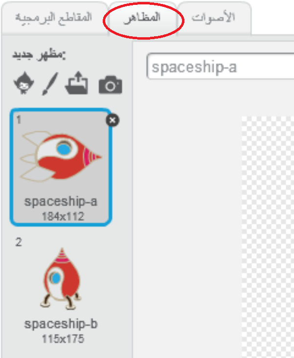
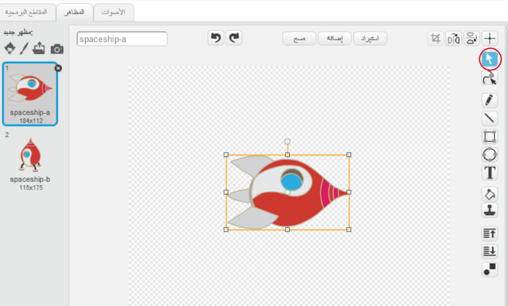
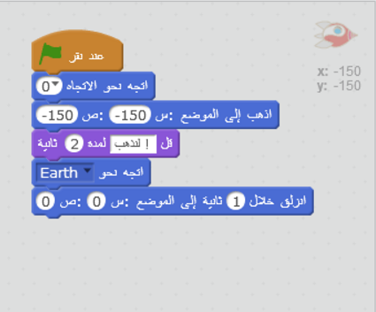

## تحريك سفينة فضاء

لننشئ سفينة فضاء تسبح نحو كوكب الأرض!

+ افتح مشروع Scratch جديدًا وفارغًا.

[[[generic-scratch-new-project]]]

+ أضف الكائنين"سفينة الفضاء" و "كوكب الأرض" إلى المنصة.
    
    

[[[generic-scratch-sprite-from-library]]]

+ أضف خلفية "النجوم" إلى المنصة.
    
    

[[[generic-scratch-backdrop-from-library]]]

+ انقر فوق كائن سفينة الفضاء، ثم انقر فوق علامة التبويب **المظاهر**.
    
    

+ استخدم أداة **السهم** لتحديد الصورة. ثم انقر فوق مقبض **التدوير الدائري**، وأدر الصورة حتى تكون مرتكزة على جانبها.
    
    

+ أضف هذه التعليمة البرمجية إلى كائن سفينة الفضاء:
    
    
    
    غيِّر الأرقام الموجودة في قوالب التعليمات البرمجية بحيث تكون التعليمات البرمجية مماثلة لتلك الموضحة في الصورة أعلاه.
    
    إذا نقرتَ على العلم الأخضر، فستجد أن سفينة الفضاء تتكلم ثم تستدير ثم تسبح نحو كوكب الأرض.
    
    

[[[generic-scratch-saving]]]

--- challenge ---

## تحدي: تحسين الرسم المتحرك

هل يمكنك تغيير الأرقام في التعليمات البرمجية للرسم المتحرك، بحيث:

+ تتحرك سفينة الفضاء حتى تُلامس كوكب الأرض؟
+ تتحرك سفينة الفضاء بشكل أبطأ نحو كوكب الأرض؟

ستحتاج إلى تغيير الأرقام في هذا القالب:

[[[generic-scratch-coordinates]]]

--- /challenge ---