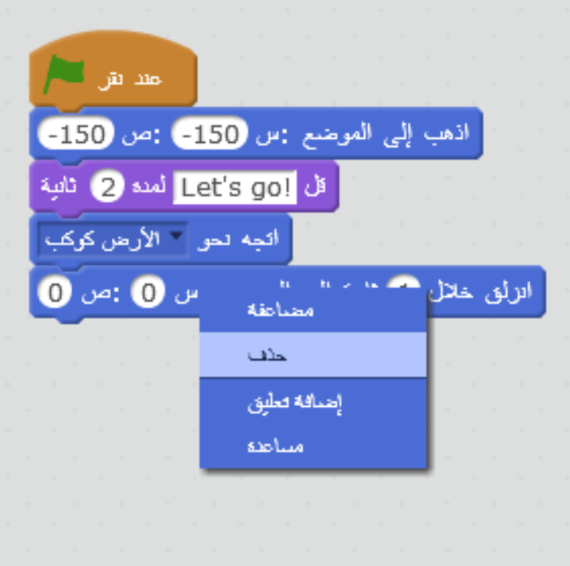
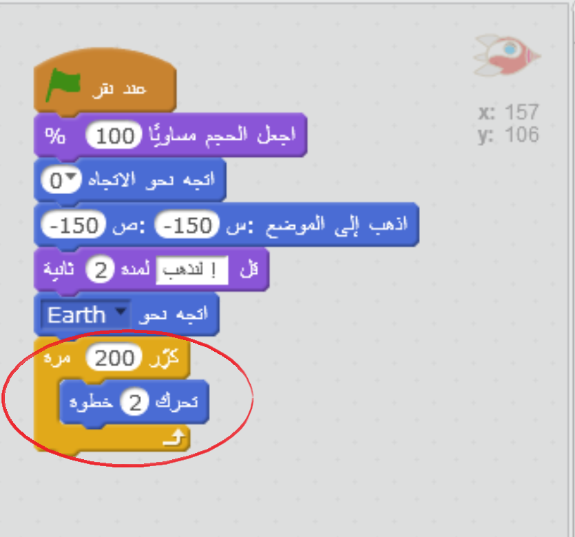
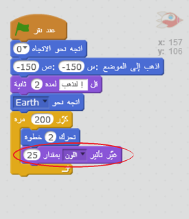
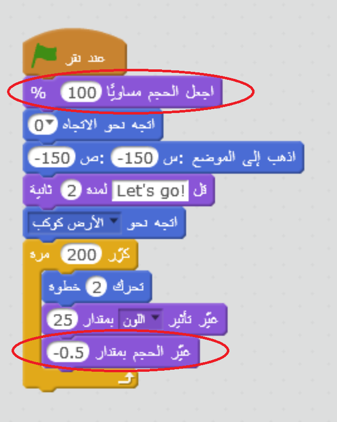

## التحريك باستخدام حلقات التكرار

توجد طريقة أخرى لتحريك سفينة الفضاء وهي أن تأمر السفينة بالتحرك مسافات صغيرة مرّات كثيرة.

+ احذف قالب `اسبح` من التعليمات البرمجية بالنقر عليها بزر الماوس الأيمن ثم النقر على **حذف**. يمكنك أيضًا حذف التعليمة البرمجية بسحبها من مساحة النص البرمجي وإعادتها إلى مساحة قوالب التعليمات البرمجية.
    
    

+ هل يمكنك استخدام قالب `كرِّر` لتحريك سفينة الفضاء نحو كوكب الأرض؟
    
    اختبر مشروعك وقم بحفظه: ستتحرَّك سفينة الفضاء نحو كوكب الأرض تمامًا كما كان من قبل، لكن باستخدام القالب `كرِّر ` في هذه المرة.
    
    

--- hints --- --- hint --- بدلًا من أن **تسبح** سفينة الفضاء، يجب أن **تتحرَّك** بشكل **متكرر** خطوات صغيرة في كل مرة. --- /hint --- --- hint --- فيما يلي التعليمات البرمجية التي ستحتاج إليها:  --- /hint --- --- hint --- هنا التعليمات البرمجية لتحريك سفينة الفضاء:  (يمكنك استخدام أرقام مختلفة بقالبي `كرِّر` و `تحرك`، طالما أن سفينة الفضاء ما زالت تقترب من كوكب الأرض!) --- /hint --- --- /hints ---

+ هل يمكنك برمجة سفينة الفضاء لتغيير لونها أثناء تحركها نحو كوكب الأرض؟
    
    اختبر مشروعك وقم بحفظه.
    
    

--- hints --- --- hint --- يجب أن **يتغير لون** سفينة الفضاء أثناء تحركها. --- /hint --- --- hint --- هنا التعليمات الإضافية التي ستحتاج إليها:  --- /hint --- --- hint --- هنا التعليمات البرمجية لتتغير لون السفينة:  --- /hint --- --- /hints ---

+ هل يمكنك تصغير حجم سفينة الفضاء تدريجيًا أثناء اقترابها من كوكب الأرض؟
    
    اختبر مشروعك وقم بحفظه. يجب أن يقل حجم سفينة الفضاء أثناء تحركها. اختبر سفينة الفضاء **مرة أخرى**. هل تكون بالحجم الصحيح عندما تبدأ؟
    
    

 --- hints --- --- hint ---يجب أن يكون حجم السفينة عندما تبدأ معينًا إلى **100%**، ثم **يتغير حجمها** تدريجيًا بمقدار صغير أثناء تحركها. --- /hint --- --- hint --- هنا التعليمات البرمجية التي ستحتاج إليها:  --- /hint --- --- hint --- هنا التعليمات البرمجية لتغيير حجم سفينة الفضاء عندما تتحرك:  --- /hint --- --- /hints ---