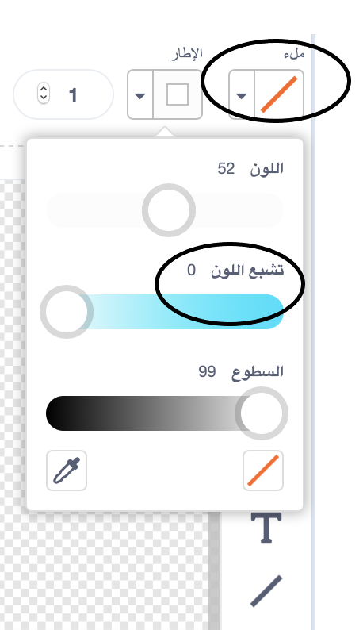

## قرد سابح

الآن سوف تضيف قردًا تائهاً في الفضاء إلى الرسوم المتحركة الخاصة بك!

\--- task \--- ابدأ بإضافة الكائن "monkey" من المكتبة.


\---/task--

إذا نقرتَ على كائن القرد الجديد ثم نقرتَ على علامة التبويب **المظاهر**، فسيمكنك تحرير/تعديل الشكل الذي سيظهر به القرد.

\--- task \--- قم بتعيين التعبئة لتكون شفافة من خلال تحديد الخط الأحمر. بالنسبة إلى الحدود الخارجية، قم بتعيين لون أبيض عن طريق تحريك منزلق تشبع اللون إلى `0`.

 \--- /task \---

\--- task \--- انقر على أداة **الدائرة** ثم استخدمها لرسم خوذة بمساحة بيضاء حول رأس القرد.


\---/task\---

\--- task \--- هل يمكنك إضافة تعليمة برمجية إلى كائن القرد بحيث يدور ببطء في دائرة بشكل مستمر؟

\--- hints \--- \--- hint \---

**عند نقر العلم الأخضر**، يجب أن **يدور** كائن القرد في دائرة **باستمرار**.

\--- /hint \--- \--- hint \---

هنا التعليمات البرمجية التي ستحتاج اليها:

```blocks3
كرِّر باستمرار
end

استدر ↻ (15) درجة

عند نقر ⚑
```

\--- /hint \--- \--- hint \---

إليك الكود لجعل قردك يدور:


```blocks3
عند نقر ⚑
كرِّر باستمرار 
  استدر ↻ (1) درجة
end
```

\--- /hint \--- \--- /hints \---

\--- /task \---

اختبر مشروعك وقم بحفظه. ستحتاج إلى النقر فوق الزر الأحمر **إيقاف** لإنهاء هذه الحركة، لأنها ستتكرَّر باستمرار!

