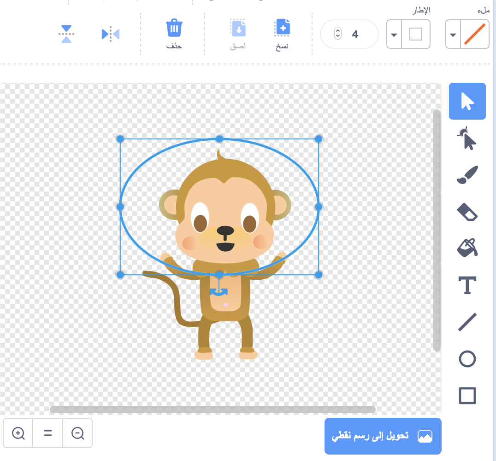
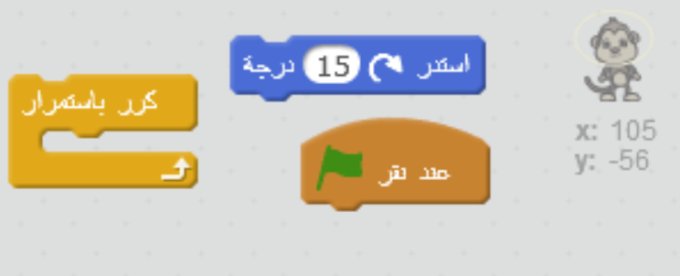
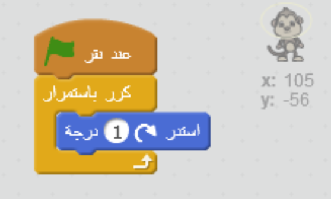

## قرد سابح

لنضِف قردًا تائهًا في الفضاء إلى الرسم المتحرك!

+ ابدأ بإضافة كائن 'القرد' من المكتبة.
    
    

+ إذا نقرتَ على كائن القرد الجديد ثم نقرتَ على علامة التبويب **المظاهر**، فسيمكنك تحرير الشكل الذي سيظهر به القرد. انقر فوق أداة **القطع الناقص** وارسم خوذة فضاء بيضاء حول رأس القرد.
    
    

+ هل يمكنك إضافة تعليمة برمجية إلى كائن القرد بحيث يدور ببطء في دائرة بشكل مستمر؟
    
    اختبر مشروعك وقم بحفظه. ستحتاج إلى النقر فوق الزر الأحمر **إيقاف** لإنهاء هذه الحركة، لأنها ستتكرَّر باستمرار!
    
    

--- hints --- --- hint --- **عند النقر فوق العلم الأخضر**، يجب أن **يدور** كائن القرد في دائرة **باستمرار**. --- /hint --- --- hint --- هنا التعليمات البرمجية التي ستحتاجها:  --- /hint --- --- hint --- هنا التعليمات البرمجية التي ستجعل القرد يدور:  --- /hint --- --- /hints ---
