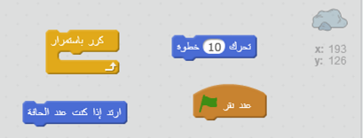
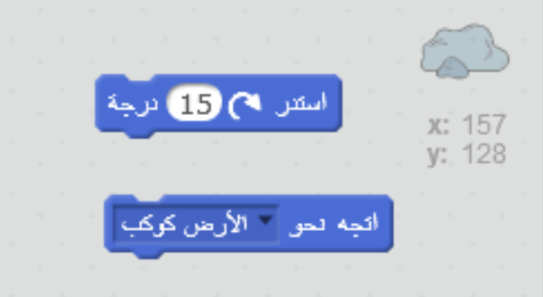
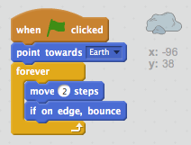

## كويكب يرتدّ

لنضف صخرة عائمة في الفضاء إلى الرسم المتحرك.

+ أضف كائن "الصخرة" الى الرسم المتحرك.
    
    

+ هل يمكنك برمجة كائن الصخرة ليرتدّ عن حواف المنصة؟
    
    

--- hints --- --- hint --- **عند النقر فوق العلم الأخضر**، يجب أن ي**تحرك** كائن الصخرة و **يرتد** عن حواف المنصة **باستمرار**. --- /hint -- - --- hint --- هنا التعليمات البرمجية التي ستحتاجها:  وبإمكانك أيضاً تعيين إتجاها الصخرة باستخدام أحد القالبين أدناه:  --- /hint --- --- hint --- هنا التعليمات البرمجية لإرتداد الصخرة عن حواف المنصة:  --- /hint --- --- /hints ---