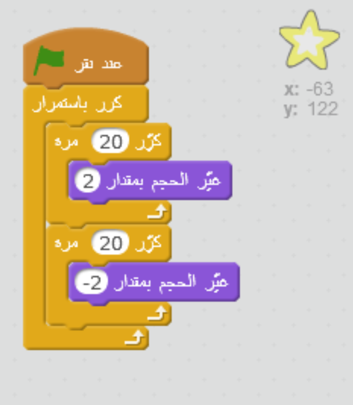

## نجم متلألئ

لندمج الحلقات لنصنع نجمًا لامعًا.

+ أضف كائن النجم إلى الرسم المتحرك.
    
    

+ هل يمكنك برمجة النجم ليكبُر حجمه ويصغُر بشكل متكرر؟
    
    

--- hints --- --- hint --- **عند النقر فوق العلم الأخضر**، يجب أن **يتغير حجم** كائن النجم ليكبُر تدريجيًا عدة مرات ثم **يتغير حجمه** ليصغُر تدريجيًا عدة مرات. ويجب أن يحدث ذلك ليكبُر النجم ثم يصغُر **باستمرار**. --- /hint --- --- hint --- هنا التعليمات البرمجية التي ستحتاجها:  --- /hint --- --- hint --- هنا التعليمات البرمجية لتجعل النجم لامع:  --- /hint --- --- /hints ---