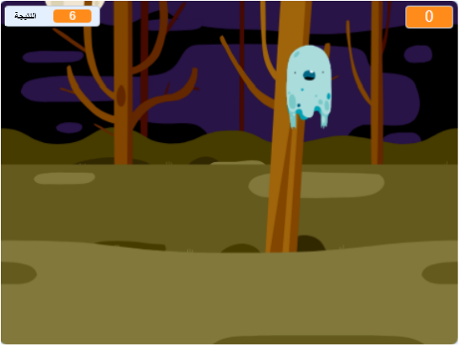

## ما التالي؟

جرّب مشروع [صائدوا الاشباح](https://projects.raspberrypi.org/en/projects/ghostbusters?utm_source=pathway&utm_medium=whatnext&utm_campaign=projects)! في هذا المشروع، سوف تتعلم كيفية إنشاء لعبة مع أشباح تظهر في كل مكان وتحتاج إلى اللحاق بها. سوف تتعلم أيضًا كيفية إضافة مؤقت ونقاط للعبة، بحيث يمكنك معرفة عدد الأشباح التي يمكنك التقاطها.

\--- no-print \---

  <iframe allowtransparency="true" width="485" height="402" src="https://scratch.mit.edu/projects/embed/276874679/?autostart=false" frameborder="0" scrolling="no"></iframe>
  

\--- /no-print \---

\--- print-only \---

\--- /print-only \---