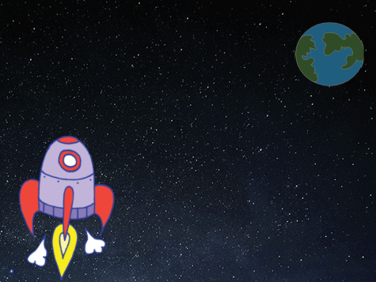
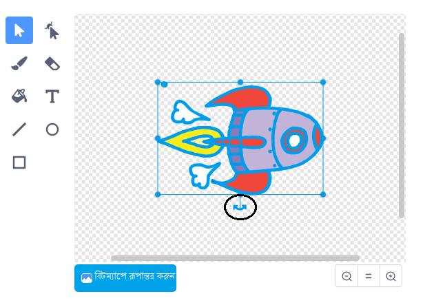
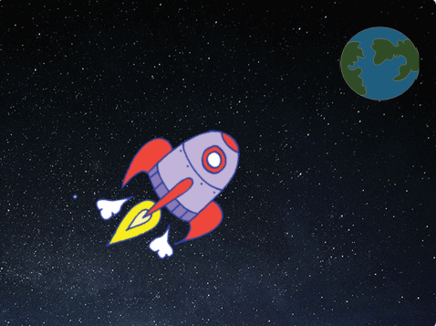

## একটি স্পেসশিপ অ্যানিমেট করে বানানো

আপনার প্রথম পদক্ষেপটি হলো একটি মহাকাশযান (spaceship) তৈরি করা যা পৃথিবীর দিকে উড়ে আসে!

--- task ---

একটি নতুন স্ক্র্যাচ প্রকল্প খুলুন।.

**Online:** একটি নতুন অনলাইন স্ক্র্যাচ প্রকল্প খুলুন [rpf.io/scratch-new](http://rpf.io/scratchon){:target="_blank"}.

**Offline:** offline editor এ একটি নতুন প্রকল্প খুলুন।.

আপনার যদি স্ক্র্যাচ offline editor ডাউনলোড এবং ইনস্টল করতে হয় তবে আপনি এটি [rpf.io/scratchoff](http://rpf.io/scratchoff){:target="_blank"} এ খুঁজে পেতে পারেন।.

--- /task ---

--- task ---

আপনার পর্যায়ে 'রকেটশিপ (rocketship)' এবং 'আর্থ (earth)' স্প্রিট (sprite) যুক্ত করুন।.


[[[generic-scratch3-sprite-from-library]]]

--- /task ---

--- task ---

পর্যায়ে 'তারার (stars)' পরিপ্রেক্ষিত (backdrop) যুক্ত করুন।.



--- /task ---

--- task ---

আপনার স্পেসশিপ স্প্রাইটে (sprite) ক্লিক করুন এবং **Costumes** এ ক্লিক করুন।.


--- /task ---

--- task ---

**তীরটি ব্যবহার করুন** পুরো স্পেসশিপ চিত্রের চারপাশে একটি বাক্সে ক্লিক করতে এবং টেনে আনতে। তারপরে বিজ্ঞপ্তি **ঘোরানোর জায়গায় ক্লিক করে** চিত্রটিকে নিজের জায়গায় না যাওয়া পর্যন্ত ঘোরান।.



--- /task ---

--- task ---

আপনার মহাকাশযান স্প্রাইটে (sprite) এই কোড যোগ করুন:


```blocks3
when flag clicked
point in direction (0)
go to x:(-150) y:(-150)
say [Let's go] for (2) seconds
point towards (Earth v)
glide (1) secs to x:(0) y:(0)
```

আপনি যে কোড ব্লকগুলি যুক্ত করেছেন তাতে নম্বরগুলি পরিবর্তন করুন যাতে কোডটি ঠিক উপরের মতই হয়।.

--- /task ---

আপনি যদি সবুজ পতাকাটিতে ক্লিক করেন তবে আপনার মহাকাশযানের কথা বলা, ঘুরে যাওয়া এবং মঞ্চের কেন্দ্রের দিকে সরে যাওয়া উচিত।.

