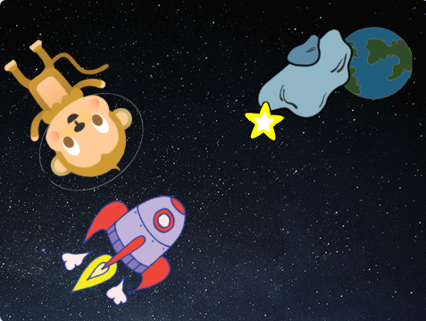

## উজ্জ্বল নক্ষত্র

এখন আপনি একটি উজ্জ্বল নক্ষত্র তৈরি করতে লুপগুলি একত্রিত করবেন।.

\--- task \---

মঞ্চে একটি নক্ষত্র sprite যোগ করুন।.



\--- /task \---

\--- task \---

নক্ষত্রের বারবার বৃদ্ধি এবং সংকোচন করার জন্য আপনি কি আপনার নক্ষত্রের sprite টিতে কোড যুক্ত করতে পারেন?


\--- hints \--- \--- hint \---

যখন সবুজ ** পতাকা ক্লিক করা হবে**, তখন আপনার নক্ষত্র sprite এর ** আকার পরিবর্তন হয়ে ** কয়েকবার বড় হবে এবং তারপরে কয়েকবার ** আকার পরিবর্তন হয়ে** ছোট হবে।. এটি এমনটি করা উচিত যাতে এটি আরও বড় হয় এবং তারপরে চিরকালের জন্য ** ছোট হয় **, দেখে মনে হবে এটি জ্বলজ্বল করছে।.

\--- /hint \--- \--- hint \---

আপনার প্রয়োজনীয় কোডগুলি এখানে রইল:

```blocks3
repeat (10)
end

when flag clicked

repeat (10)
end

change size by (10)

change size by (10)

forever
```

\--- /hint \--- \--- hint \---

আপনার নক্ষত্রের বৃদ্ধি এবং সংকোচন করার জন্য এখানে কোড দেওয়া হয়েছে:


```blocks3
when flag clicked
forever
    repeat (20)
        change size by (2)
    end
    repeat (20)
        change size by (-2)
    end

```

\--- /hint \--- \--- /hints \--- \--- /task \---