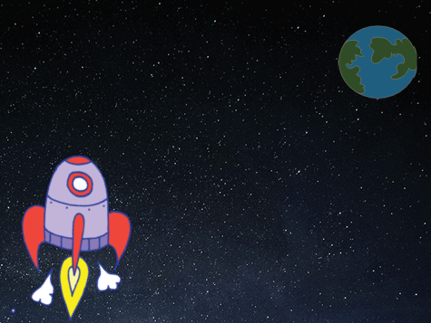

## Animeiddio llong ofod

Y cam cyntaf fydd creu llong ofod sy'n hedfan tuag at y Ddaear!

\--- task \---

Agor prosiect Scratch newydd.

**Online:** open a new online Scratch project at [rpf.io/scratch-new](https://rpf.io/scratchon){:target="_blank"}.

**All-lein** agora brosiect newydd yn y golygydd all-lein.

If you need to download and install the Scratch offline editor, you can find it at [rpf.io/scratchoff](https://rpf.io/scratchoff){:target="_blank"}.

\--- /task \---

\--- task \---

Add 'rocketship' and 'Earth' sprites to your Stage.


[[[generic-scratch3-sprite-from-library]]]

\--- /task \---

\--- task \---

Add the 'Stars' backdrop to your Stage.



\--- /task \---

\--- task \---

Click on your spaceship sprite, and click on the **Costumes** tab.


\--- /task \---

\--- task \---

Use the **arrow** tool to click and drag a box around the whole spaceship image. Then click on the circular **rotate** handle, and rotate the image until it is on its side.


\--- /task \---

\--- task \---

Add this code to your spaceship sprite:


```blocks3
pan fo'r flag werdd yn cael ei glicio
pwyntio i gyfeiriad (0)
mynd i x: (-150) y: (-150)
dweud [Awn ni!] am (2) eiliad
pwyntio tuag at (Earth v)
llithro (1) eiliad i x: (0) y: (0)
```

Change the numbers in the code blocks you've added so that the code is exactly the same as above.

\--- /task \---

If you click the green flag, you should see the spaceship speak, turn, and glide towards the centre of the stage.

