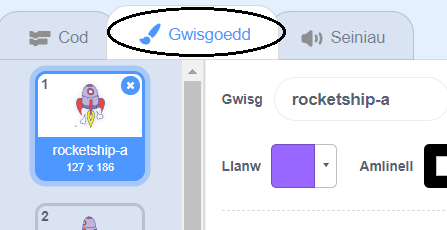
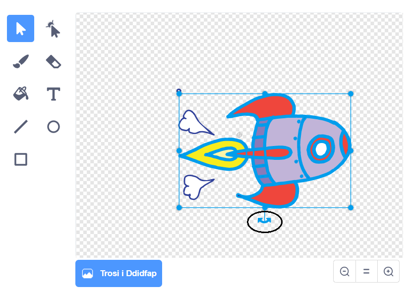

## Amineiddio llong ofod

Rydym am greu llong ofod sydd yn hedfan tuag at y Ddaear!

+ Cychwyna brosiect Scratch newydd, a dileu ciplun y gath fel bod eich prosiect yn wag.  Mae modd dod o hyd i'r golygydd Scratch arlein yma <a href="http://jumpto.cc/scratch-new" target="_blank">jumpto.cc/scratch-new</a>.

+ Ychwanega gipluniau 'Llong Ofod' a 'Daear' i dy lwyfan, yna cer ati i ychwanegu cefndir 'Sêr' i dy lwyfan.  Fe ddylai dy lwyfan nawr edrych fel hyn:

	

+ Gwasga ar giplun dy long ofod newydd, a gwasga'r tab 'Gwisgoedd'.

	

+ Defnyddia'r botwm dewis i ddethol y llun.  Yna gwasga ar y ddolen cylchdroi, i droi y llun tan ei fod ar ei ochr.

	

+ Ychwanega y côd yma i giplun dy long ofod:

	

	Newida y rhifau yn y blociau côd, fel bod y côd union yr un peth â'r ddelwedd uchod.

+ Os gwnei di glicio ar y bloc côd, fe ddylst ti weld y llong ofod yn siarad, troi a symud tuag at ganol y llwyfan.

	

	Safle sgrin `x:(0) y:(0)`{:class="blockmotion"} yw canol y llwyfan. Mae safle fel `x:(-150) y:(-150)`{:class="blockmotion"} tuag at gwaelod chwith y llwyfan, ac mae safle fel `x:(150) y:(150)`{:class="blockmotion"} yn agos i gornel top dde y llwyfan.

	

	Os oes angen i ti wybod cyfesur safle ar y llwyfan, symuda'r llygoden i'r safle yr hoffet ti a gwna nodyn o'r rhifau cyfesur, sydd i'w gweld o dan y llwyfan.

	

+ Profa dy animeiddiad, trwy wasgu ar y faner werdd uwchben y llwyfan.

	

--- challenge ---
## Her: Perffeithio dy animeiddiad
Alli di newid y rhifau yn y côd amineiddio fel bod
+ Y llong ofod yn cyffwrdd y Ddaear?
+ Y llong ofod yn symud yn arafach tuag at y Ddaear?

Bydd angen i ti newid y rhifau yn y bloc yma:

  

--- /challenge ---
