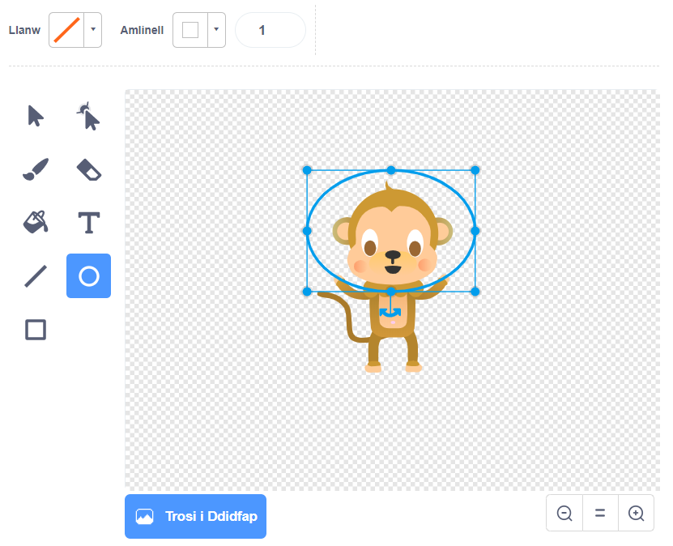

## Mwcni yn Arnofio

Ewn ni ati i ychwanegu mwnci i dy amineiddiad, sydd ar goll yn y gofod!

+ Dechreua gan ychwanegu ciplun mwnci o'r llyfrgell.

	

+ Os wyt ti'n gwasgu ar fy fwnci newydd yna gwasgu 'Gwisgoedd', mae modd i ti chwarae gyda'r ffordd mae'r mwnci yn edrych.  Gwasga ar y teclyn 'Elips', a thynna llun helmet gofod gwyn o gwmpas pen y mwnci.

	

+ Nawr gwasga 'Sgriptiau' ac ychwanega y côd yma i'r mwnci, fel ei fod yn troi yn araf mewn cylch am byth:

	

	Mae'r bloc `Am Byth`{:class="blockcontrol"} yn ddolen arall, ond y tro yma un sydd byth yn gorffan.

+ Gwasga'r faner i brofi dy fwnci.  Bydd angen i ti wasgu y botwm 'Stop' (drws nesaf i'r faner) i orffen yr amineiddiad yma.

	
