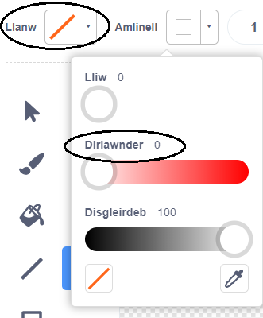

## Mwnci yn arnofio

Fe fyddi di nawr yn ychwanegu mwnci sydd ar goll yn y gofod i dy animeiddiad!

\--- task \--- Ychwanega gorlun mwnci o’r llyfrgell.


\--- /task \---

Clicia ar gorlun dy fwnci newydd yna clicia **Gwisgoedd** fel bod modd golygu sut mae'r mwnci yn edrych.

\--- task \--- Dewisa'r llenwad i fod yn un tryloyw gan ddewis y llinell goch. Ar gyfer yr amlinelliad, gosoda lliw gwyn gan symud y llithrydd i `0`.

 \--- /task \---

\--- task \--- Clicia'r teclyn **cylch** a'i ddefnyddio i dynnu llun helmet gofod gwyn o gwmpas pen y mwnci.


\--- /task \---

\--- task \--- Alli di ychwanegu côd i gorlun dy fwnci fel ei fod yn troi'n araf mewn cylch am byth?

\--- hints \--- \--- hint \---

Pan fo'r faner werdd **wedi ei glicio**, fe ddylai corlun dy fwnci **droi** mewn cylch **am byth**.

\--- /hint \--- \--- hint \---

Dyma'r blociau côd rwyt ti eu hangen:

```blocks3
am byth
end

troi (15) gradd i'r dde

pan fo'r flag werdd yn cael ei glicio
```

\--- /hint \--- \--- hint \---

Dyma'r côd i wneud i dy fwnci droi:


```blocks3
pan fo'r flag werdd yn cael ei glicio
am byth 
  troi (1) gradd i'r dde
end
```

\--- /hint \--- \--- /hints \---

\--- /task \---

Profa ac arbed dy brosiect. Bydd angen i ti glicio'r botwm coch **stop** i orffen yr animeiddiad gan ei fod yn para am byth!

