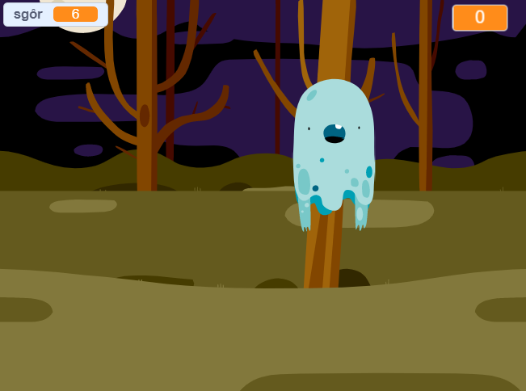

## Beth nesaf?

Rho gynnig ar y prosiect [Dal Ysbrydion](https://projects.raspberrypi.org/cy-GB/projects/ghostbusters?utm_source=pathway&utm_medium=whatnext&utm_campaign=projects)! Yn y prosiect yna, fe fyddi di'n creu gêm gydag ysbrydion fydd yn ymddangos ar draws y sgrin a bydd angen i ti eu dal. Byddi di hefyd yn dysgu ychwanegu amserydd a sgôr i'r gêm, fel dy fod di'n gallu gweld faint o ysbrydion mae modd i ti eu dal.

--- no-print ---

  <iframe allowtransparency="true" width="485" height="402" src="https://scratch.mit.edu/projects/embed/334694895/?autostart=false" frameborder="0" scrolling="no"></iframe>
  

--- /no-print ---

--- print-only ---

--- /print-only ---