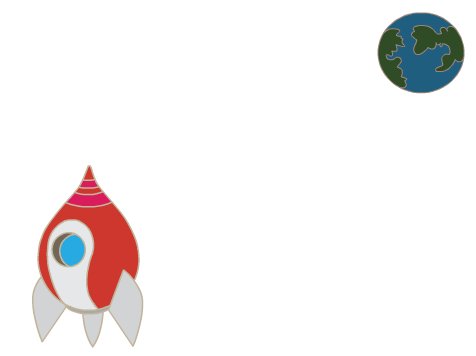
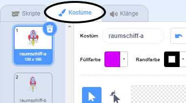
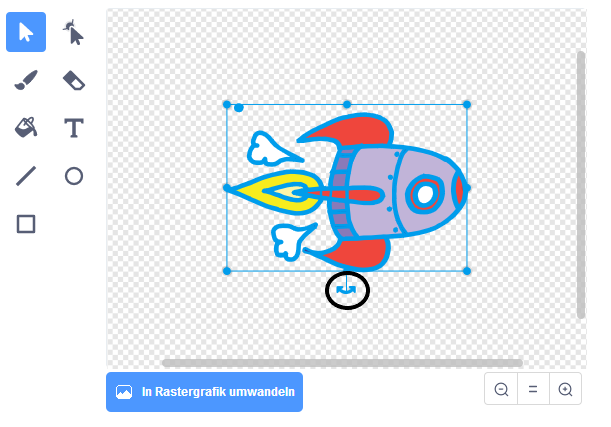
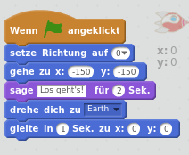
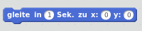

## Ein Raumschiff animieren

Lass uns ein Raumschiff bauen, das zur Erde fliegt!

+ Öffne ein neues Scratch-Projekt.

[[[generic-scratch-new-project]]]

+ Füge die Figuren 'Raumschiff' und 'Erde' zu deiner Bühne hinzu.
    
    

[[[generic-scratch-sprite-from-library]]]

+ Füge deiner Bühne das Bühnenbild "stars" (Sterne) hinzu.
    
    

[[[generic-scratch-backdrop-from-library]]]

+ Klicke auf deine Raumschiff-Figur und klicke auf den Reiter **Kostüme**.
    
    

+ Verwende das **Pfeil** Werkzeug, um das Bild auszuwählen. Dann klickst du auf den kreisförmigen **drehen-**-Griff und drehst das Bild, bis es auf der Seite liegt.
    
    

+ Füge deiner Raumschiff-Figur diesen Code hinzu:
    
    
    
    Ändere die Zahlen in den Codeblöcken, damit der Code genau wie im Bild oben aussieht.
    
    Wenn du auf die grüne Flagge klickst, sollten Sie sehen, wie das Raumschiff "spricht", sich dreht und zur Mitte der Bühne gleitet.
    
    

[[[generic-scratch-saving]]]

--- challenge ---

## Herausforderung: Verbessere deine Animation

Kannst du die Zahlen in deinem Animationscode ändern, so dass:

+ Sich das Raumschiff bewegt, bis es die Erde berührt?
+ Sich das Raumschiff langsamer auf die Erde zu bewegt?

Du musst die Zahlen in diesem Block ändern:

[[[generic-scratch-coordinates]]]

--- /challenge ---
