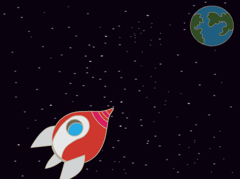

## Animieren mit Schleifen

Eine andere Möglichkeit das Raumschiff zu animieren ist, es ganz oft kleine Schritte machen zu lassen

\--- task \--- Lösche den `gleite`{:class="block3motion"}-Block aus deinem Skript. Ziehe dafür den Block aus dem Code-Bereich und lasse ihn da los wo die anderen einzelnen Codeblöcke sind.


```blocks3
Wenn die Flagge angeklickt wird
setze Richtung auf (0) Grad
gehe zu x:(-150) y:(-150)
sage [Los geht´s] für (2) Sekunden
drehe dich zu (Erde v)

-gleite in (1) Sek. zu x:(0) y:(0)
```

\--- /task \---

\--- task \--- Benutze nun einen `wiederhole`{:class="block3control"} Block um dein Raumschiff Richtung Erde zu verschieben!




```blocks3
Wenn die Flagge angeklickt wird
setze Richtung auf (0) Grad
gehe zu x:(-150) y:(-150)
sage [Los geht´s] für (2) Sekunden
drehe dich zu (Erde v)

+wiederhole (200) mal
    gehe (2)er Schritt
```

Teste und speichere deinen Code. Dein Raumschiff sollte sich genau wie zuvor zur Erde bewegen, aber diesmal mit Hilfe eines `wiederhole ... mal`{:class="block3control}-Blocks.

\--- /task \---

\--- task \--- Füge als nächstes Code zu deiner Raumschiff-Figur hinzu, so dass das Raumschiff seine Farben ändert wenn es sich auf die Erde zu bewegt!

Verwende diesen Block:


```blocks3
Wenn die Flagge angeklickt wird
setze Richtung auf (0) Grad
gehe zu x:(-150) y:(-150)
sage [Los geht´s] für (2) Sekunden
drehe dich zu (Erde v)
wiederhole (200) mal
    gehe (2)er Schritt

+    ändere Effekt [Farbe v] um (25)
```

Teste und speichere nun dein Projekt.


\--- /task \---

\--- task \--- Kannst du dein Raumschiff auf seinem Weg zur Erde kleiner werden lassen?

\--- hints \---

\--- hint \---

Dein Raumschiff sollte bei `Größe 100`{:class="blocklooks"}% beginnen und dann, jedes mal wenn es sich bewegt, ein kleines bisschen seine `Größe ändern`{:class="blocklooks"}.

\--- /hint \---

\--- hint \---

Du musst diese Blöcke zu deinem Code hinzufügen:


```blocks3
ändere Größe um (10)

setze Größe auf (100)
```

\--- /hint \---

\--- hint \---

Dein Code sollte so aussehen:


```blocks3
Wenn die Flagge angeklickt wird
setze Größe auf (100)
setze Richtung auf (0) Grad
gehe zu x:(-150) y:(-150)
sage [Los geht´s] für (2) Sekunden
drehe dich zu (Erde v)
wiederhole (200) mal
    gehe (2)er Schritt
    ändere Effekt [Farbe v] um (25)

+    ändere Größe um (-0.3)
```

\--- /hint \---

\---/hints\---

\--- /task \---

Testeund speichere deinen Code. Dein Raumschiff sollte kleiner werden, während es sich bewegt. Teste dein Raumschiff ein **zweites mal**. Hat es beim Start die richtige Größe?

