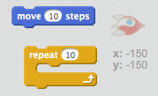
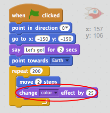
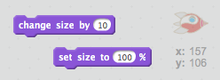

## Animieren mit Schleifen

Eine andere Möglichkeit das Raumschiff zu animieren ist, es ganz oft kleine Schritte machen zu lassen.

+ Lösche den `gleite in` Block aus deinem Code, indem du darauf rechtsklickst und dann **Löschen** klickst. Du kannst Code auch löschen, indem du ihn aus dem Skriptbereich zurück in den Bereich Codeblöcke ziehst.
    
    

+ Kannst du einen `wiederhole ... mal` Block verwenden, um dein Raumschiff zur Erde zu bewegen?
    
    Testen und speichern: Dein Raumschiff sollte sich genau wie zuvor zur Erde bewegen, diesmal mit Hilfe eines `wiederhole ... mal`-Blocks.
    
    

--- hints --- --- hint --- Statt **gleite** sollte dein Raumschiff **wiederholt** den Block **gehe ... er-Schritt** verwenden. --- /hint --- --- hint --- Hier sind die Code-Blöcke, die du brauchst:  --- /hint --- --- hint --- Hier ist der Code, um dein Raumschiff zu animieren:  (Du kannst verschiedene Zahlen in den beiden Blöcken `wiederhole ... mal` und `gehe ... er-Schritt` probieren, solange das Raumschiff nur zur Erde gelangt) --- /hint --- --- /hints ---

+ Kannst du dein Raumschiff so programmieren, dass es seine Farbe ändert, während es sich der Erde nähert?
    
    Testen und speichern.
    
    

--- hints --- --- hint --- Dein Raumschiff sollte die **Farbe wechseln** während es sich bewegt. --- /hint --- --- hint --- Hier ist der zusätzliche Codeblock, den du brauchst:  --- /hint --- --- hint --- Hier ist der Code, um die Farbe des Raumschiffs zu ändern:  --- /hint --- --- /hints ---

+ Kannst du dein Raumschiff auf seinem Weg zur Erde kleiner werden lassen?
    
    Testen und speichern. Dein Raumschiff sollte kleiner werden, während es sich bewegt. Teste dein Raumschiff ein **zweites mal**. Hat es beim Start die richtige Größe?
    
    

--- hints --- --- hint --- Dein Raumschiff sollte mit **100% Größe** beginnen, und während es fliegt um kleine Beträge die **Größe ändern**. --- /hint --- --- hint --- Hier sind die Code-Blöcke, die du brauchen wirst:  --- /hint --- --- hint --- Hier ist der Code, um die Größe des Raumschiffs während des Fluges zu ändern:  --- /hint --- --- /hints ---
