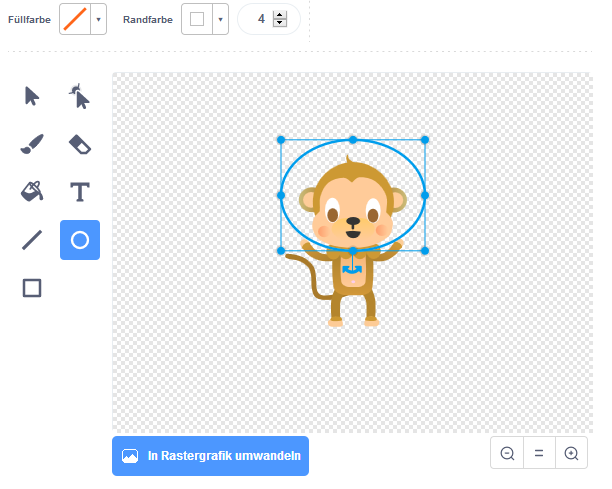
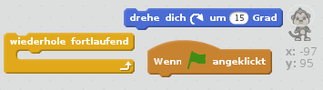
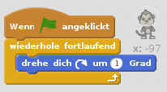

## Schwebender Affe

Lass uns einen Affen zu deiner Animation hinzufügen, der im Weltraum verloren gegangen ist!

+ Beginne mit dem Hinzufügen der "Monkey1"-Figur aus der Bibliothek.
    
    

+ Wenn du auf deine neue Affen-Figur und dann auf das Register **Kostüme** klickst, kannst du das Aussehen des Affen bearbeiten. Klicke auf das **Ellipse**-Werkzeug und zeichne einen weißen Helm um den Kopf des Affen.
    
    

+ Kannst du deiner Affen-Figur Code hinzufügen, so dass er sich fortlaufend langsam im Kreis dreht?
    
    Teste und speichere dein Projekt. Du musst auf das rote **Stopschild** klicken, um diese Animation zu beenden - sonst läuft sie für immer!
    
    

--- hints --- --- hint --- Wenn die grüne **Flagge angeklickt** wird, soll sich die Affen-Figur **fortlaufend** im Kreis **drehen**. --- /hint --- --- hint --- Hier sind die Code Blöcke, die du brauchen wirst:  --- /hint --- --- hint --- Hier ist der Code, der deinen Affen rotieren lässt:  --- /hint --- --- /hints ---
