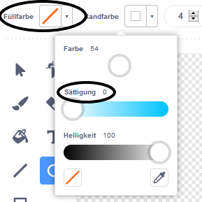

## Schwebender Affe

Lass uns einen Affen, der im Weltraum verloren gegangen ist, zu deiner Animation hinzufügen!

--- task --- Beginne mit dem Hinzufügen der "Monkey" (Affe) Figur aus der Bibliothek.


--- /task ---

Klicke auf deine neue Affen Figur und dann auf **Kostüme** um das Aussehen des Affen zu bearbeiten.

--- task --- Setze die Füllfarbe auf Transparent, indem du den roten Strich auswählst. Für die Umrandung wähle eine weiße Frabe, indem du den Sättigung-Regler auf `0` stellst.

 --- /task ---

--- task --- Klicke auf das **Kreis**-Werkzeug und zeichne einen weißen Helm um den Kopf des Affen.


--- /task ---

--- task --- Kannst du deiner Affen-Figur Code hinzufügen, so dass er sich fortlaufend langsam im Kreis dreht?

--- hints ---
 --- hint ---

Wenn die grüne **Flagge angeklickt** wird, soll sich die Affen-Figur **fortlaufend** im Kreis **drehen**.

--- /hint --- --- hint ---

Hier sind die Codeblöcke die du brauchst:

```blocks3
wiederhole fortlaufend

drehe dich im Uhrzeigersinn um (15) Grad

Wenn grüne Flagge angeklickt wird
```

--- /hint --- --- hint ---

Hier ist der Code, um deinen Affen zum Drehen zu bringen:


```blocks3
Wenn die Flagge angeklickt wird
wiederhole fortlaufend
    drehe dich im Uhrzeigersinn um (1) Grad
```

--- /hint --- --- /hints ---

--- /task ---

Teste und speichere dein Projekt. Du musst auf das rote **Stopschild** klicken, um diese Animation zu beenden, da sie ja fortlaufend läuft!

