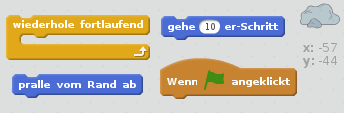
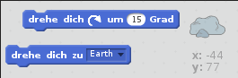
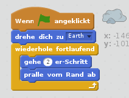

## Abprallender Asteroid

Lass' uns deine Animation um einen schwebenden Weltraumbrocken ergänzen.

+ Füge deiner Animation eine Rocks- (Felsen-) Figur hinzu.
    
    

+ Kannst du deinen Felsen so programmieren, dass er auf der Bühne herumzuspringt?
    
    

--- hints --- --- hint --- Wenn die grüne **Flagge angeklickt** wird, sollte sich deine Felsen-Figur **bewegen** und quer über die Bühne hüpfen, indem sie **fortlaufend** **vom Rand abprallt**. --- /hint --- --- hint --- Hier sind die Code Blöcke, die brauchen wirst:  Mit einem solchen Block kannst du eine etwas interessantere Startrichtung für den Felsen wählen:  --- /hint --- --- hint --- Hier ist der Code, um deinen Felsen über die ganze Bühne hüpfen zu lassen:  --- /hint --- --- /hints ---
