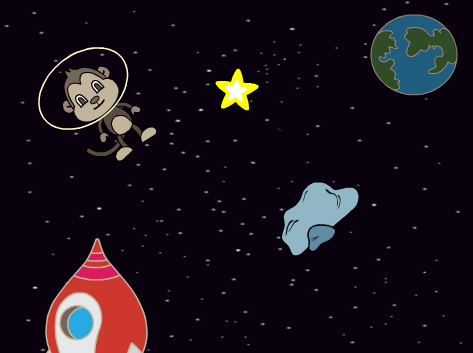
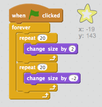

## Glänzender Stern

Lass' uns Schleifen kombinieren, um einen glänzenden, strahlenden Stern zu machen.

+ Füge deiner Animation eine "Star1"- (Stern1-) Figur hinzu.
    
    

+ Kannst du deinen Stern so programmieren, dass er abwechselnd wächst und wieder schrumpft?
    
    

--- hints --- --- hint --- Wenn die grüne **Flagge angeklickt ** wird, sollte dein Stern ein paar mal die **Größe ändern** und dabei wachsen, und dann wieder ein paar mal **die Größe ändern** und dabei kleiner werden. Es sollte so sein, dass er **fortlaufend** wächst und schrumpft. --- /hint --- --- hint --- Hier sind die Code Blöcke, die du brauchen wirst:  --- /hint --- --- hint --- Hier ist der Code, der deinen Stern glänzen lässt:  --- /hint --- --- /hints ---
