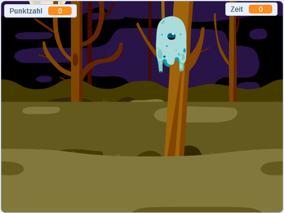

## Was kommt als nächstes?

Schau dir das [Geisterjäger](https://projects.raspberrypi.org/en/projects/ghostbusters?utm_source=pathway&utm_medium=whatnext&utm_campaign=projects) Projekt an! In diesem Projekt wirst du lernen, wie du ein Spiel mit Geistern erstellst, die überall auftauchen und die du Fangen musst. Du wirst auch lernen wie du eine Stoppuhr und einen Punktezähler zu deinem Spiel hinzufügst, um zu sehen wieviele Geister du fangen kannst.

\--- no-print \---

  <iframe allowtransparency="true" width="485" height="402" src="https://scratch.mit.edu/projects/embed/276874679/?autostart=false" frameborder="0" scrolling="no"></iframe>
  

\--- /no-print \---

\--- print-only \---

\--- /print-only \---