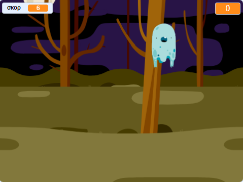

## Και τώρα;

Δοκίμασε το έργο [Κυνηγοί φαντασμάτων ](https://projects.raspberrypi.org/el-GR/projects/ghostbusters?utm_source=pathway&utm_medium=whatnext&utm_campaign=projects)! Σε αυτό το έργο θα μάθεις να δημιουργείς ένα παιχνίδι όπου θα εμφανίζονται φαντάσματα και θα προσπαθείς να τα πιάσεις. Θα μάθεις επίσης να προσθέτεις χρονόμετρο και βαθμολογία στο παιχνίδι, έτσι ώστε να μπορείς να δεις πόσα φαντάσματα μπορείς να πιάσεις.

--- no-print ---

  <iframe allowtransparency="true" width="485" height="402" src="https://scratch.mit.edu/projects/embed/276874679/?autostart=false" frameborder="0" scrolling="no"></iframe>
  

--- /no-print ---

--- print-only ---

--- /print-only ---