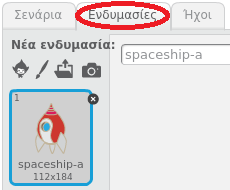
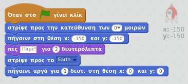

## Βήμα 1: Δίνοντας κίνηση σε ένα διαστημόπλοιο

Ας κάνουμε ένα διαστημόπλοιο που πετά προς τη Γη!

+ Άνοιξε ένα νέο έργο στο Scratch.

[[[generic-scratch-new-project]]]

+ Πρόσθεσε τα αντικείμενα "spaceship" και "Earth" στο σκηνικό σου.
    
    

[[[generic-scratch-sprite-from-library]]]

+ Πρόσθεσε το υπόβαθρο "Stars" στο σκηνικό σου.
    
    

[[[generic-scratch-backdrop-from-library]]]

+ Κάνε κλικ στο αντικείμενο διαστημόπλοιο και ξανά κλικ στην καρτέλα **Ενδυμασίες**.
    
    

+ Χρησιμοποίησε το **βέλος** για να επιλέξεις την εικόνα. Στη συνέχεια, κάνε κλικ στη στρόγγυλη **περιστρεφόμενη** λαβή και περιέστρεψε την εικόνα μέχρι να γυρίσει στο πλάϊ.
    
    

+ Πρόσθεσε αυτόν τον κώδικα στο αντικείμενο διαστημόπλοιο:
    
    
    
    Άλλαξε τους αριθμούς στα μπλοκ έτσι ώστε ο κώδικας να είναι ακριβώς ίδιος όπως στην παραπάνω εικόνα.
    
    Αν κάνεις κλικ στην πράσινη σημαία, θα πρέπει να δεις το διαστημόπλοιο να μιλά, να γυρίζει και να γλιστρά προς το κέντρο του σκηνικού.
    
    

[[[generic-scratch-saving]]]

--- challenge ---

## Πρόκληση: βελτίωση του κινούμενου σχεδίου σου

Μπορείς να αλλάξεις τους αριθμούς στον κώδικα έτσι ώστε:

+ Το διαστημόπλοιο να κινείται μέχρι να αγγίξει τη Γη;
+ Το διαστημόπλοιο να κινείται πιο αργά προς τη Γη;

Θα χρειαστεί να αλλάξεις τους αριθμούς σε αυτό το μπλοκ:

[[[generic-scratch-coordinates]]]

--- /challenge ---