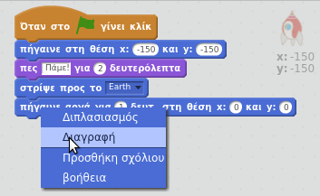
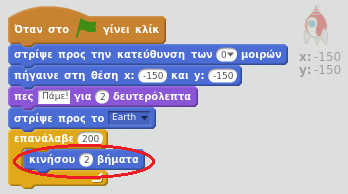
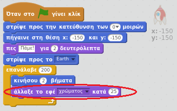
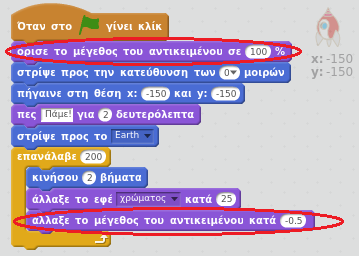

## Βήμα 2: Δίνοντας κίνηση χρησιμοποιώντας βρόχους

Ένας άλλος τρόπος να ζωντανέψεις το διαστημόπλοιο είναι να του πεις να κινείται ελάχιστα αλλά πολλές φορές.

+ Διάγραψε το μπλοκ `ολίσθησης` από τον κώδικα σου κάνοντας δεξί κλικ πάνω του και πατώντας **διαγραφή**. Μπορείς επίσης να διαγράψεις τον κώδικα σύροντάς τον από την περιοχή κωδικοποίησης πίσω στην περιοχή μπλοκ κώδικα.
    
    

+ Μπορείς να χρησιμοποιήσεις ένα μπλοκ `επανάληψης` για να κινήσεις το διαστημόπλοιο σου προς τη Γη;
    
    Δοκίμασε και αποθήκευσε: Το διαστημόπλοιο θα πρέπει να κινείται προς τη Γη ακριβώς όπως και πριν, χρησιμοποιώντας αυτή τη φορά ένα μπλοκ `επανάληψης`.
    
    

--- hints --- --- hint --- Αντί να **ολισθαίνει**, το διαστημόπλοιο θα πρέπει **επαναλαμβανόμενα** **να κινείται** μερικά βήματα κάθε φορά. --- /hint --- --- hint --- Εδώ είναι τα μπλοκ κώδικα που θα χρειαστείς:  --- /hint --- --- hint --- Έτσι πρέπει να είναι ο κώδικάς σου:  (Μπορείς να χρησιμοποιήσεις διαφορετικούς αριθμούς στα μπλοκ `επανάληψης` και `κίνησης`, όσο το διαστημόπλοιο κινείται προς τη Γη!) --- /hint --- --- /hints ---

+ Μπορείς να προγραμματίσεις το διαστημόπλοιό σου να αλλάζει χρώμα καθώς κινείται προς τη Γη;
    
    Δοκίμασε και αποθήκευσε.
    
    

--- hints --- --- hint --- Το διαστημόπλοιο πρέπει **να αλλάζει χρώμα** καθώς κινείται. --- /hint --- --- hint --- Εδώ είναι τα επιπλέον μπλοκ κώδικα που θα χρειαστείς:  --- /hint --- --- hint --- Εδώ είναι ο κώδικας για να αλλάζεις το χρώμα του διαστημοπλοίου σου:  --- /hint --- --- /hints ---

+ Μπορείς να μικραίνεις το διαστημόπλοιο καθώς κινείται προς τη Γη;
    
    Δοκίμασε και αποθήκευσε. Το διαστημόπλοιο θα πρέπει να γίνεται μικρότερο καθώς κινείται. Δοκίμασε το διαστημόπλοιο μία **δεύτερη φορά**. Έχει το σωστό μέγεθος όταν ξεκινάει;
    
    

--- hints --- --- hint --- Το διαστημόπλοιο θα πρέπει να ξεκινά με το **100% μέγεθος** και, στη συνέχεια, **να αλλάζει μέγεθος** ελάχιστα καθώς κινείται. --- /hint --- --- hint --- Εδώ είναι τα επιπλέον μπλοκ κώδικα που θα χρειαστείς:  --- /hint --- --- hint --- Εδώ είναι ο κώδικας για να αλλάζεις το μέγεθος του διαστημοπλοίου σου καθώς κινείται:  --- /hint --- --- /hints ---