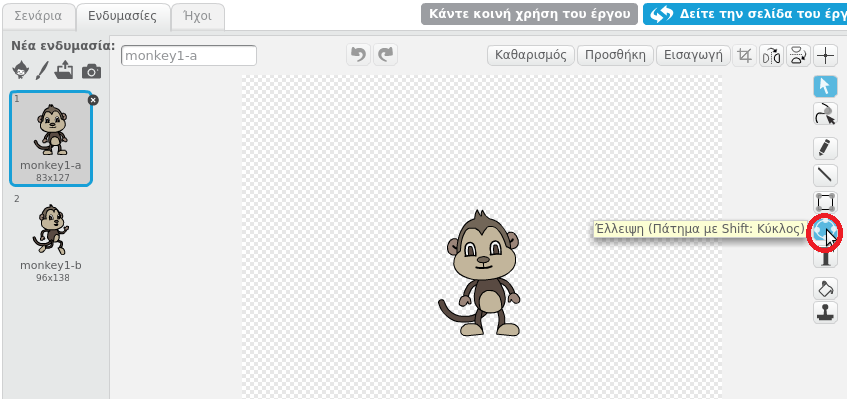
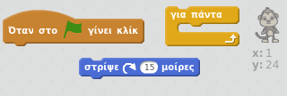
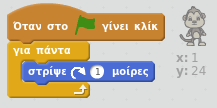

## Βήμα 3: Πλωτή μαϊμού

Ας προσθέσουμε μία μαϊμού που χάθηκε στο διάστημα στο κινούμενο σχέδιο!

+ Άρχισε με την προσθήκη του αντικειμένου "monkey" από τη βιβλιοθήκη.
    
    

+ Αν κάνεις κλικ στο νέο αντικείμενο monkey και ξανά κλικ στην καρτέλα **Ενδυμασίες**, μπορείς να επεξεργαστείς τον τρόπο εμφάνισης της μαϊμούς. Κάνε κλικ στο εργαλείο **έλλειψη** και σχεδίασε ένα λευκό διαστημικό κράνος γύρω από το κεφάλι της μαϊμούς.
    
    

+ Μπορείς να προσθέσεις κώδικα στο αντικείμενο monkey έτσι ώστε να περιστρέφεται αργά σε έναν κύκλο για πάντα;
    
    Δοκίμασε και αποθήκευσε το έργο σου. Θα πρέπει να κάνεις κλικ στο κόκκινο κουμπί **τερματισμού** για να τερματίσεις το κινούμενο σχέδιο, καθώς συνεχίζεται για πάντα!
    
    

--- hints --- --- hint --- Όταν η πράσινη **σημαία πατηθεί**, η μαϊμού πρέπει **να γυρίζει** σε έναν κύκλο **για πάντα**. --- /hint --- --- hint --- Εδώ είναι τα μπλοκ κώδικα που θα χρειαστείς:  --- /hint --- --- hint --- Να ο κώδικάς σου για να κάνεις τη μαϊμού να περιστρέφεται:  --- /hint --- --- /hints ---