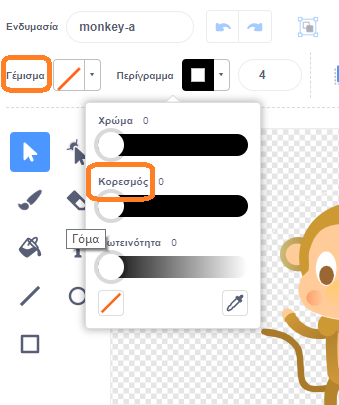

## Αιωρούμενη μαϊμού

Τώρα θα προσθέσεις μία μαϊμού που χάθηκε στο διάστημα στο κινούμενο σχέδιο!

\--- task \--- Άρχισε με την προσθήκη του αντικειμένου "monkey" από τη βιβλιοθήκη.


\--- /task \---

Κάνε κλικ στο νέο αντικείμενο monkey και ξανά κλικ στην καρτέλα **Ενδυμασίες**, έτσι ώστε να επεξεργαστείς τον τρόπο εμφάνισης της μαϊμούς.

\--- task \--- Κάνε το γέμισμα διαφανές επιλέγοντας την κόκκινη γραμμη. Για το περίγραμμα, επικεξε ένα άσπρο χρώμα μετακινώντας τον Κορεσμό στο `0`.

 \--- /task \---

\--- Κάνε κλικ στο εργαλείο **κύκλος** και χρησιμοποίησέ το για να σχεδιάσεις ένα λευκό διαστημικό κράνος γύρω από το κεφάλι της μαϊμούς.


\--- /task \---

\--- task \--- Μπορείς να προσθέσεις κώδικα στο αντικείμενο monkey έτσι ώστε να περιστρέφεται αργά σε έναν κύκλο για πάντα;

\--- hints \--- \--- hint \---

Όταν η πράσινη **σημαία πατηθεί**, η μαϊμού πρέπει **να γυρίζει** σε έναν κύκλο **για πάντα**.

\--- /hint \--- \--- hint \---

Εδώ είναι τα μπλοκ που χρειάζεσαι:

```blocks3
forever
end

turn cw (15) degrees

when flag clicked
```

\--- /hint \--- \--- hint \---

Εδώ είναι ο κώδικας για να κάνεις τη μαϊμού σου να περιστρέφεται:


```blocks3
when flag clicked
forever
    turn cw (1) degrees
```

\--- /hint \--- \--- /hints \---

\--- /task \---

Δοκίμασε και αποθήκευσε το έργο σου. Θα πρέπει να κάνεις κλικ στο κόκκινο κουμπί **τερματισμού** για να τερματίσεις το κινούμενο σχέδιο, καθώς συνεχίζεται για πάντα!

