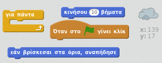
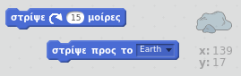
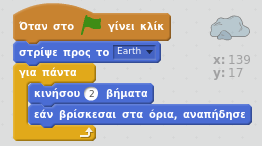

## Βήμα 4: Αναπήδηση αστεροειδούς

Ας προσθέσουμε κάποιους διαστημικούς βράχους στο κινούμενο σχέδιο.

+ Πρόσθεσε ένα αντικείμενο "rock" στο κινούμενο σχέδιο.
    
    

+ Μπορείς να προγραμματίσεις το βράχο να αναπηδά μέσα στο σκηνικό;
    
    

--- hints --- --- hint --- Όταν πατήσετε το πράσινο **σημαία**, ο σκίτης σας πρέπει να κινηθεί και **αναπήδηση** γύρω από τη σκηνή **για πάντα**. --- /hint --- --- hint --- Εδώ είναι τα μπλοκ κώδικα που θα χρειαστείς:  Μπορείς επίσης να ορίσεις μια πιο ενδιαφέρουσα αρχική κατεύθυνση για το βράχο με ένα από αυτά τα μπλοκ:  --- /hint --- --- hint --- Εδώ είναι ο κώδικας για να αναπηδά ο βράχος σας στο σκηνικό:  --- /hint --- --- /hints ---
