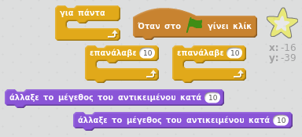

## Βήμα 5: Φωτεινό αστέρι

Ας συνδυάσουμε βρόχους για να κάνουμε ένα λαμπερό αστέρι.

+ Πρόσθεσε ένα αντικείμενο "star" στο κινούμενο σχέδιο.
    
    

+ Μπορείς να προγραμματίσεις το αστέρι σου ώστε να αυξάνεται και να συρρικνώνεται επαναληπτικά;
    
    

--- hints --- --- hint --- Όταν η πράσινη **σημαία πατηθεί**, το αντικείμενο αστέρι θα πρέπει **να αλλάζει το μέγεθος** για να γίνει μεγαλύτερο μερικές φορές και στη συνέχεια **να αλλάζει μέγεθος** για να γίνει μικρότερο μερικές φορές. Θα πρέπει να το κάνει αυτό ώστε να αυξάνεται και στη συνέχεια να συρρικνώνεται **για πάντα**. --- /hint --- --- hint --- Εδώ είναι τα μπλοκ κώδικα που θα χρειαστείς:  --- /hint --- --- hint --- Εδώ είναι ο κώδικας που κάνει το αστέρι σας να λάμπει:  --- /hint --- --- /hints ---