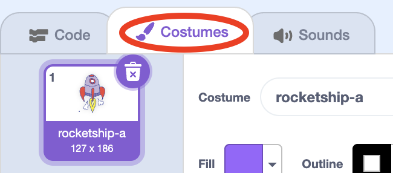
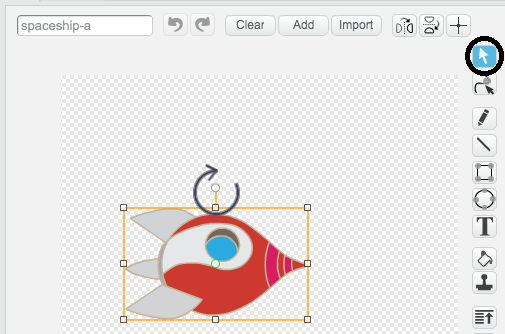
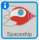

## Animating a spaceship

Your first step will be to create a spaceship that flies towards the Earth!

--- task ---

Open a new Scratch project.

**Online:** open a new online Scratch project at [rpf.io/scratchon](http://rpf.io/scratchon).

**Offline:** open a new project in the offline editor.

If you need to download and install the Scratch offline editor, you can find it at [rpf.io/scratchoff](http://rpf.io/scratchoff).

--- /task ---

--- task ---
Add 'spaceship' and 'Earth' sprites to your Stage.


[[[generic-scratch-sprite-from-library]]]

--- /task ---

--- task ---
Add the 'Stars' backdrop to your Stage.


--- /task ---

--- task ---
Click on your spaceship sprite, and click on the **Costumes** tab.



--- /task ---

--- task ---
Use the **arrow** tool to select the spaceship image. Then click on the circular **rotate** handle, and rotate the image until it is on its side.



--- /task ---

--- task ---
Add this code to your spaceship sprite:



```blocks
when flag clicked
point in direction (0)
go to x:(-150) y:(-150)
say [Let's go] for (2) secs
point towards [Earth v]
glide (1) secs to x:(0) y:(0)
```

Change the numbers in the code blocks you've added so that the code is exactly the same as above.

--- /task ---

If you click the green flag, you should see the spaceship speak, turn, and glide towards the centre of the stage.


