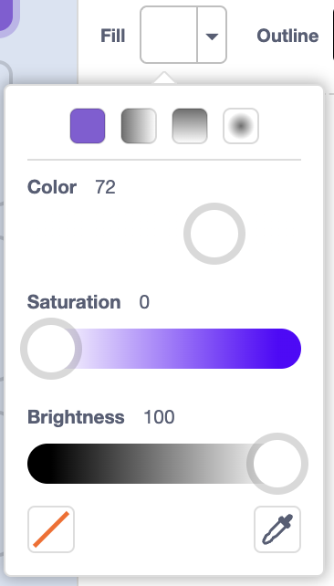

## Floating monkey

Now you will add a monkey who's lost in space to your animation!

--- task ---

Start by adding the 'monkey' sprite from the library.


--- /task ---

---- task ---

Click on your new monkey sprite and then click on **Costumes** so that you can edit how the monkey looks.

--- /task ---

--- task ---

Set the fill to be transparent by selecting the red line. For the outline, set a white colour by moving the Saturation slider to `0`.



--- /task ---

--- task ---

Click on the **circle** tool and then use it to draw a white space helmet around the monkey's head.


--- /task ---

--- task ---

Add code to your monkey sprite so that it spins slowly in a circle forever:


```blocks3
when flag clicked
forever
    turn cw (1) degrees
```

--- /task ---

---- task ---

Test and save your project. 

You'll have to click on the red **stop** button to end this animation, as it runs forever!


--- /task ---
