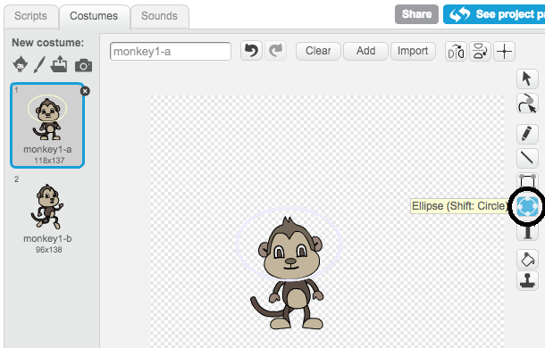

## Floating monkey

Now you will add a monkey who's lost in space to your animation!

--- task ---
Start by adding the 'monkey' sprite from the library.


--- /task ---

Click on your new monkey sprite and then click on **Costumes** so that you can edit how the monkey looks.

--- task ---
Click on the **ellipse** tool and then use it to draw a white space helmet around the monkey's head.



--- /task ---

--- task ---
Can you add code to your monkey sprite so that it spins slowly in a circle forever?

--- hints ---
--- hint ---

When the green __flag is clicked__, your monkey sprite should __turn__ in a circle __forever__.

--- /hint ---
--- hint ---

Here are the code blocks you need:


--- /hint ---
--- hint ---

Here's the code to make your monkey spin:


```blocks
when flag clicked
forever
    turn cw (1) degrees
```
--- /hint ---
--- /hints ---

--- /task ---

Test and save your project. You'll have to click on the red **stop** button to end this animation, as it runs forever!


