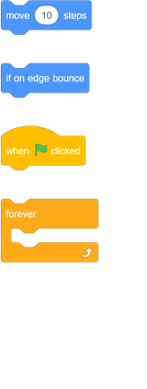
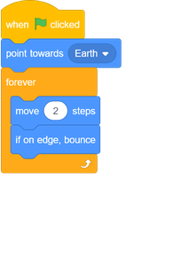

## Bouncing asteroid

Now you will add a floating space rock to your animation.

--- task ---
Add a 'rock' sprite to your animation.

--- /task ---

--- task ---
Can you add code for your rock sprite so that the rock bounces around the stage?

--- hints ---
--- hint ---
When the green __flag is clicked__, your rock sprite should __move__ and __bounce__ around the stage __forever__.
--- /hint ---
--- hint ---
Here are the code blocks you need:

You can also set a more interesting starting direction for the rock sprite with one of these blocks:

--- /hint ---
--- hint ---

Here's the code for making your rock bounce around the stage:

--- /hint ---
--- /hints ---
--- /task ---
