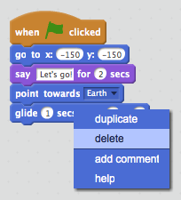

## Animar usando bucles

Otra manera de animar la nave espacial es decirle que se mueva distancias pequeñas, muchas veces.

+ Elimina el bloque `deslizar`{:class="blockmotion"} de tu código haciendo clic con el botón derecho en el bloque y seleccionando "borrar". También puedes borrar código arrastrándolo del área de Programas al área de los bloques de código.

	

+ Una vez hayas eliminado el código, añade este código en su lugar:

	

	El bloque `repetir`{:class="blockcontrol"} se usa para repetir algo muchas veces, y también se conoce como un __bucle__.

+ Si haces clic en la bandera para probar este nuevo código, verás que hace casi lo mismo que antes.

+ Puedes añadir más código a tu bucle, para hacer cosas interesantes. Añade al bucle el bloque `cambiar efecto color por 25`{:class="blocklooks"} (de la sección "Apariencia"), para cambiar el color de la nave espacial repetidamente a medida que se mueve:

	

+ Haz clic en la bandera para ver tu nueva animación.

	

+ También puedes hacer que tu nave espacial se haga más pequeña a medida que se mueve hacia la Tierra.

	

+ Prueba tu animación. ¿Qué ocurre si haces clic en la bandera una segunda vez? ¿Tu nave espacial empieza con el tamaño correcto? Puedes usar este bloque para fijar tu animación:

	```blocks
	fijar tamaño a (100) %
	```
