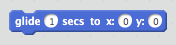

## Paso 1: Animación de una nave espacial

¡Hagamos una nave espacial que vuela hacia la Tierra!

+ Abre un nuevo proyecto de Scratch vacío.

[[[generic-scratch-new-project]]]

+ Añade los objetos 'spaceship' (nave espacial) y 'Earth' (la Tierra) a tu escenario.
    
    

[[[generic-scratch-sprite-from-library]]]

+ Agrega el fondo "stars" (estrellas) a tu escenario.
    
    

[[[generic-scratch-backdrop-from-library]]]

+ Haz clic en la figura de tu nave espacial y luego haz clic en la pestaña **Disfraces**.
    
    

+ Usa la herramienta **flecha** para seleccionar la imagen. Luego haz clic en el manejador redondo **rotar**, y gira la imagen hasta que esté de lado.
    
    

+ Agrega este código a tu figura de la nave espacial:
    
    
    
    Cambia los números en los bloques de código para que el código sea exactamente el mismo que en la imagen de arriba.
    
    Si haces clic en la bandera verde, deberías ver que la nave espacial habla, gira y se desliza hacia el centro del escenario.
    
    

[[[generic-scratch-saving]]]

--- challenge ---

## Desafío: Mejora tu animación

¿Puedes cambiar los números en tu código de animación para que:

+ La nave espacial se mueva hasta que toca la Tierra?
+ La nave espacial se mueva más despacio hacia la Tierra?

Deberás cambiar los números en este bloque:

[[[generic-scratch-coordinates]]]

--- /challenge ---