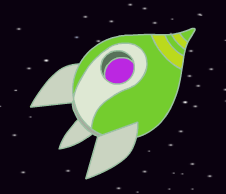

## Animación usando bucles

Otra forma de animar la nave espacial es decirle que se mueva una pequeña cantidad muchas veces

\--- task \---

Delete the `glide`{:class="block3motion"} block from your code. To do this, drag the block off the Code area and drop it back where the other single code blocks are.


```blocks3
cuando la bandera es pulsada
apuntar en dirección (0)
ir a x:(-150) y:(-150)
decir [Vamos] durante (2) segundos
apuntar hacia (Tierra v)

- deslizar en (1) segs a x:(0) y:(0)
```

\--- /task \---

\--- task \---

Now use a `repeat`{:class="block3control"} block to move your spaceship towards the Earth?


```blocks3
cuando la bandera es pulsada
apuntar en dirección (0)
ir a x:(-150) y:(-150)
decir [Vamos] durante (2) segundos
apuntar hacia (Tierra v)

+ repetir(200)
    mover (2) pasos
```

Prueba y guarda tu código. Tu nave espacial debería moverse hacia la Tierra exactamente como antes, pero esta vez usa un bloque `repetir`{:class="block3control"}.

\--- /task \---

\--- task \---

Next add code to your spaceship sprite so that the spaceship changes colour as it moves towards Earth?

Usa este bloque:


```blocks3
cuando la bandera es pulsada
apuntar en dirección (0)
ir a x:(-150) y:(-150)
decir [Vamos] durante (2) segundos
apuntar hacia (Tierra v)
 repetir(200)
    mover (2) pasos

+    sumar a [color v] (25)
```

Prueba y guarda tu código.



\--- /task \---

\--- task \---

Can you make your spaceship get smaller as it moves towards Earth?

\--- hints \---

\--- hint \---

Tu nave espacial debe comenzar a `tamaño 100%`{:class="blocklooks"}, y luego `cambiar de tamaño`{:class="blocklooks"} en una pequeña cantidad cada vez que se mueva.

\--- /hint \---

\--- hint \---

Tendrás que añadir estos bloques a tu código:


```blocks3
cambiar tamaño por (10)

fijar tamaño al (100) %
```

\--- /hint \---

\--- hint \---

Tu código debería verse así:


```blocks3
cuando la bandera es pulsada
fijar tamaño al (100) %
apuntar en dirección (0)
ir a x:(-150) y:(-150)
decir [Vamos] durante (2) segundos
apuntar hacia (Tierra v)
repetir(200)
    mover (2) pasos
    sumar a [color v] (25)

+   cambiar tamaño por (-3)
```

\--- /hint \---

\--- /hints \---

\--- /task \---

Prueba y guarda tu código. Tu nave espacial debería hacerse más pequeña a medida que se mueve. Prueba tu nave espacial una **segunda vez**. ¿Tiene el tamaño correcto cuando comienza?

