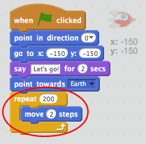
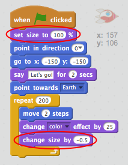

## Paso 2: Animar utilizando bucles

Otra forma de animar la nave espacial es decirle que se mueva una pequeña cantidad muchas veces.

+ Elimina el bloque `deslizar` de tu código haciendo clic derecho sobre él y haciendo clic en **eliminar**. También puedes eliminar código arrastrándolo fuera del área de programas y devolviéndolo al área de bloques de código.
    
    

+ ¿Puedes usar un bloque de `repetición` para mover tu nave espacial hacia la Tierra?
    
    Prueba y guarda: Tu nave espacial debería moverse hacia la Tierra exactamente como antes, esta vez usando un bloque de `repetición`.
    
    

--- hints --- --- hint --- En lugar de **deslizarse**, tu nave espacial se debería **mover** **repetidamente** unos pocos pasos a la vez. --- /hint --- --- hint --- Aquí están los bloques de código que necesitarás:  --- /hint --- --- hint --- Este es el código para animar tu nave espacial:  (Puedes utilizar números diferentes en los bloques de `repetir` y `mover`, siempre que la nave espacial llegue a la Tierra) --- /hint --- --- /hints ---

+ ¿Puedes codificar tu nave espacial para cambiar el color a medida que se mueve hacia la Tierra?
    
    Prueba y guarda.
    
    

--- hints --- --- hint --- Tu nave espacial debería **cambiar de color** mientras se mueve. --- /hint --- --- hint --- Aquí tienes el bloque de código extra que necesitarás:  --- /hint --- --- hint --- Aquí tienes el código para cambiar el color de tu nave espacial:  --- /hint --- --- /hints ---

+ ¿Puedes hacer que tu nave espacial se haga más pequeña a medida que llega a la Tierra?
    
    Prueba y guarda. Tu nave espacial debería hacerse más pequeña mientras se mueve. Prueba tu nave espacial una **segunda vez**. ¿El tamaño es correcto cuando comienza?
    
    

--- hints --- --- hint --- Tu nave espacial debería comenzar con un **tamaño del 100%** y luego ir **cambiando su tamaño** un poco cada vez a medida que se mueve. --- /hint --- --- hint --- Aquí tienes los bloques de código que necesitarás:  --- /hint --- --- hint --- Aquí tienes el código para cambiar el tamaño de tu nave espacial mientras se mueve:  --- /hint --- --- /hints ---
