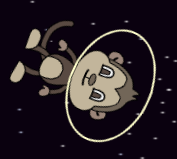
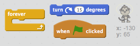
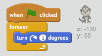

## Paso 3: Mono flotante

¡Agreguemos un mono perdido en el espacio a tu animación!

+ Comienza agregando la figura 'monkey' (mono) de la biblioteca.
    
    

+ Si haces clic en tu nueva figura del mono y luego haces clic en **Disfraces**, puedes editar el aspecto del mono. Haz clic en la herramienta de **elipse** y dibuja un casco espacial blanco alrededor de la cabeza del mono.
    
    

+ ¿Puedes agregar código a la figura de tu mono para que gire lentamente en un círculo para siempre?
    
    Prueba y guarda tu proyecto. Tendrás que hacer clic en el botón rojo de **parada** para finalizar esta animación, ¡ya que continúa para siempre!
    
    

--- hints --- --- hint --- Cuando **se hace clic en la bandera** verde, la figura de tu mono debería **girar** en un círculo **para siempre**. --- /hint --- --- hint --- Aquí tienes los bloques de código que necesitarás:  --- /hint --- --- hint --- Aquí tienes el código para hacer que tu mono gire:  --- /hint --- --- /hints ---