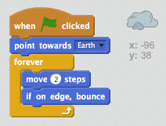

## Paso 4: Un asteroide que rebota

Agreguemos una roca espacial flotante a tu animación.

+ Agrega la figura 'rock' (roca) a tu animación.
    
    

+ ¿Puedes codificar la figura de la roca para rebotar alrededor del escenario?
    
    

--- hints --- --- hint --- Cuando **se hace clic en la bandera** verde, tu figura de la roca se debería **mover** y **rebotar** alrededor del escenario **para siempre**. --- /hint --- --- hint --- Aquí tienes los bloques de código que vas a necesitar:  También puedes establecer una dirección inicial más interesante para la roca con uno de estos bloques:  --- /hint --- --- hint --- Aquí tienes el código para que tu roca rebote alrededor del escenario:  --- /hint --- --- /hints ---
