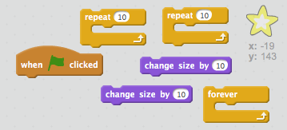

## Paso 5: Una estrella brillante

Combinemos los bucles para hacer una estrella brillante.

+ Agrega una figura 'star' (estrella) a tu animación.
    
    

+ ¿Puedes codificar tu estrella para que crezca y se encoja repetidamente?
    
    

--- hints --- --- hint --- Cuando **se hace clic en la bandera** verde, tu figura estrella debería **cambiar de tamaño** para hacerse más grande unas cuantas veces, y luego **cambiar de tamaño** para hacerse más pequeña unas cuantas veces. Debería hacer esto para que crezca y luego se encoja **para siempre**. --- /hint --- --- hint --- Aquí tienes los bloques de código que necesitarás:  --- /hint --- --- hint --- Aquí tienes el código para que brille tu estrella:  --- /hint --- --- /hints ---
