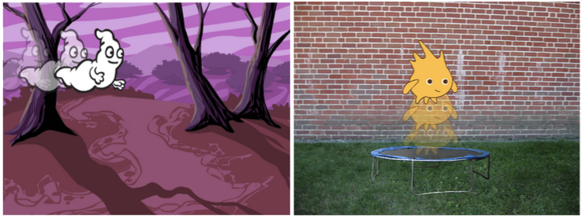

--- challenge ---

## Desafío: Haz tu propia animación

Detén tu animación espacial, guárdala e inicia un nuevo proyecto Scratch.

Usa lo que has aprendido en este proyecto para hacer tu propia animación. Puede ser lo que quieras, pero trata de hacer que tu animación coincida con la configuración. Aquí hay unos ejemplos:

--- /challenge ---
***
### Traducción aportada por la comunidad 

Este proyecto fue traducido por **Emma Tweed/María Alejandra Aguada/Montse Verdaguer** y revisado por **Helmut Schlimper**. 

Nuestros increíbles voluntarios de traducción nos ayudan a dar a los niños de todo el mundo la oportunidad de aprender a programar. Puedes ayudarnos a llegar a más niños traduciendo nuestros proyectos. Consigue más información en [rpf.io/translators](https://rpf.io/translators).
