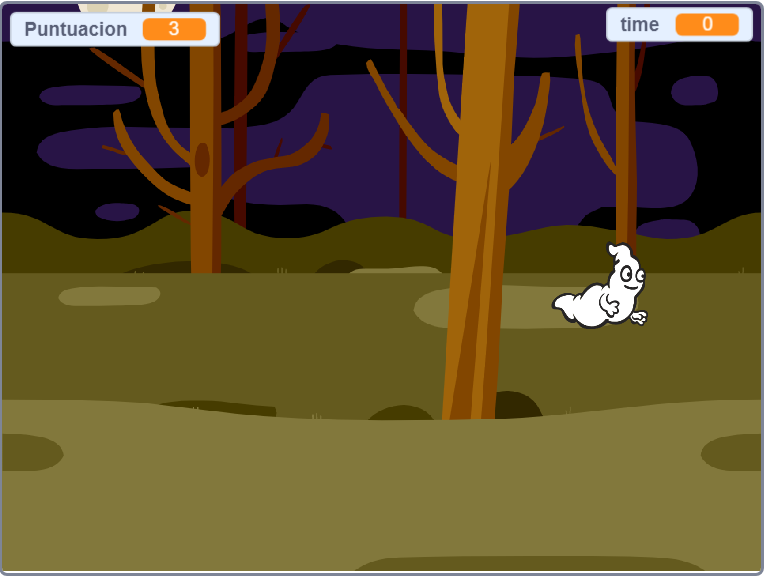

## ¿Qué sigue?

¡Prueba el proyecto [Cazafantasmas](https://projects.raspberrypi.org/es-ES/projects/ghostbusters?utm_source=pathway&utm_medium=whatnext&utm_campaign=projects)! En ese proyecto, aprenderás como crear un juego con fantasmas que aparecen por todas partes y que tú necesitas atrapar. También aprenderás cómo añadir un cronómetro y una puntuación al juego, para que puedas ver cuántos fantasmas eres capaz de atrapar.

--- no-print ---

  <iframe allowtransparency="true" width="485" height="402" src="https://scratch.mit.edu/projects/embed/276874679/?autostart=false" frameborder="0" scrolling="no"></iframe>
  

--- /no-print ---

--- print-only ---

--- /print-only ---

Traducción aportada por la comunidad

Este proyecto fue traducido por **Emma Tweed**/**Asun Alsina** y revisado por **Helmut Schlimper**/**Luis J. Sanz**.

Nuestros increíbles voluntarios de traducción nos ayudan a dar a los niños de todo el mundo la oportunidad de aprender a programar. Puedes ayudarnos a llegar a más niños traduciendo nuestros proyectos. Consigue más información en [rpf.io/translate](https://rpf.io/translate).
