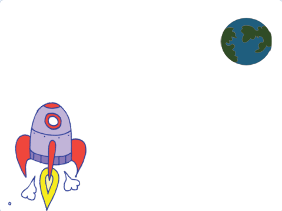
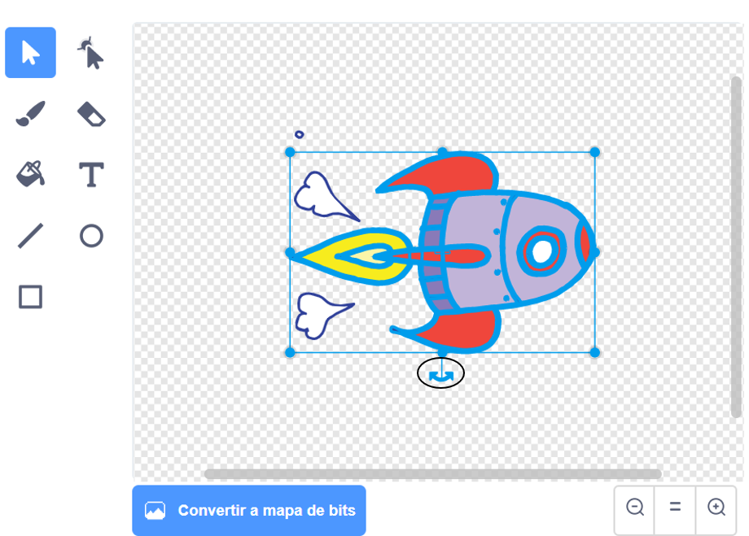

## Animación de una nave espacial

¡Tu primer paso será crear una nave espacial que vuele hacia la Tierra!

--- task ---

Abre un nuevo proyecto Scratch.

**Online**: abre un nuevo proyecto Scratch en línea en [rpf.io/scratch-new](http://rpf.io/scratchon){:target="_blank"}.

**Offline:** Abre un nuevo proyecto en el editor offline.

Si necesitas descargar e instalar el editor offline de Scratch, puedes encontrarlo en [rpf.io/scratchoff](http://rpf.io/scratchoff){:target="_blank"}.

--- /task ---

--- task ---

Añade los objetos "Nave Espacial" ("Rocketship") y "Tierra" ("Earth") a tu escenario.



[[[generic-scratch3-sprite-from-library]]]

--- /task ---

--- task ---

Agrega el fondo "Estrellas" ("Stars") a tu escenario.


--- /task ---

--- task ---

Haz clic en la figura de tu nave espacial y luego haz clic en la pestaña **Disfraces**.


--- /task ---

--- task ---

Usa la herramienta **flecha** para seleccionar y arrastra un recuadro alrededor de la nave espacial. Luego haz clic en el asa circular **rotar**, y gira la imagen hasta que esté de lado.



--- /task ---

--- task ---

Agrega este código a tu figura de la nave espacial:


```blocks3
when flag clicked
point in direction (0)
go to x:(-150) y:(-150)
say [Vamos!] for (2) seconds
point towards (Tierra v)
glide (1) secs to x:(0) y:(0)
```

Cambia los números en los bloques de código que has agregado para que el código sea exactamente igual al de arriba.

--- /task ---

Si haces clic en la bandera verde, deberías ver que la nave espacial habla, gira y se desliza hacia el centro del escenario.

