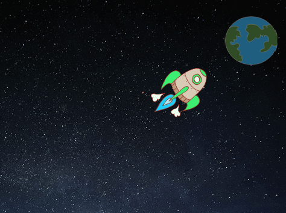

## Animación usando bucles

Otra forma de animar la nave espacial es decirle que se mueva una pequeña cantidad muchas veces

\--- task \---

Eliminar el `deslizamiento ` {:class = "block3motion"} del bloque de tu código. Para hacer esto, arrastra el bloque fuera del área de Código y suéltalo donde están los otros bloques de código único.


```blocks3
when flag clicked
point in direction (0)
go to x:(-150) y:(-150)
say [Let's go] for (2) seconds
point towards (Earth v)

- glide (1) secs to x:(0) y:(0)
```

\--- /task \---

\--- task \---

Now use a `repeat`{:class="block3control"} block to move your spaceship towards the Earth.


```blocks3
when flag clicked
point in direction (0)
go to x:(-150) y:(-150)
say [Let's go] for (2) seconds
point towards (Earth v)

+ repeat (200)
    move (2) steps
```

Prueba y guarda tu código. Tu nave espacial debería moverse hacia la Tierra exactamente como antes, pero esta vez usa un bloque de `repetición`>{:class="block3control"}.

\--- /task \---

\--- task \---

A continuación, ¿añade código a tu objeto nave espacial para que la nave espacial cambie de color a medida que avanza hacia la Tierra?

Usa este bloque:


```blocks3
when flag clicked
point in direction (0)
go to x:(-150) y:(-150)
say [Let's go] for (2) seconds
point towards (Earth v)
repeat (200)
    move (2) steps

+    change [color v] effect by (25)
```

Prueba y guarda tu código.


\--- /task \---

\--- task \---

¿Puedes hacer que tu nave espacial se haga más pequeña a medida que se mueve hacia la Tierra?

\--- hints \---

\--- hint \---

Tu nave espacial debe comenzar a `tamaño 100%`{:class="blocklooks"}, y luego `cambiar de tamaño`{:class="blocklooks"} en una pequeña cantidad cada vez que se mueva.

\--- /hint \---

\--- hint \---

Tendrás que añadir estos bloques a tu código:


```blocks3
change size by (10)

set size to (100) %
```

\--- /hint \---

\--- hint \---

Tu código debería verse así:


```blocks3
when flag clicked

+ set size to (100) %
point in direction (0)
go to x:(-150) y:(-150)
say [Let's go] for (2) seconds
point towards (Earth v)
repeat (200)
    move (2) steps
    change [color v] effect by (25)
+   change size by (-0.3)
```

\--- /hint \---

\--- /hints \---

\--- /task \---

Prueba y guarda tu código. Tu nave espacial ahora debería hacerse más pequeña a medida que se mueve. Prueba tu nave espacial una ** segunda vez **. ¿Es el tamaño correcto cuando comienza?

