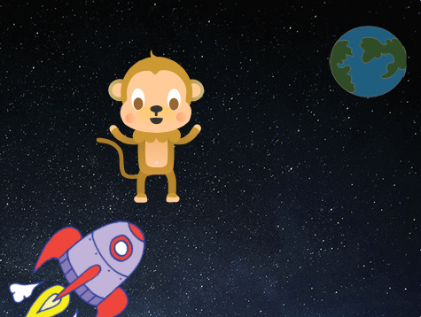
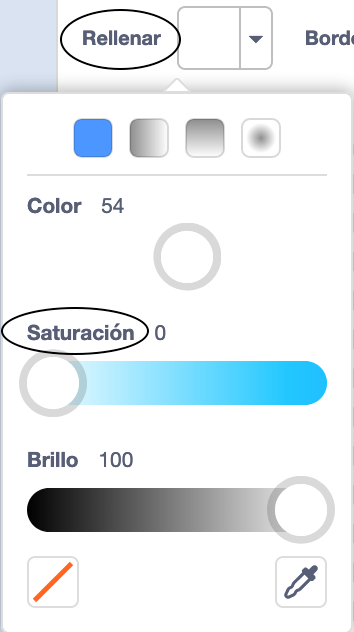
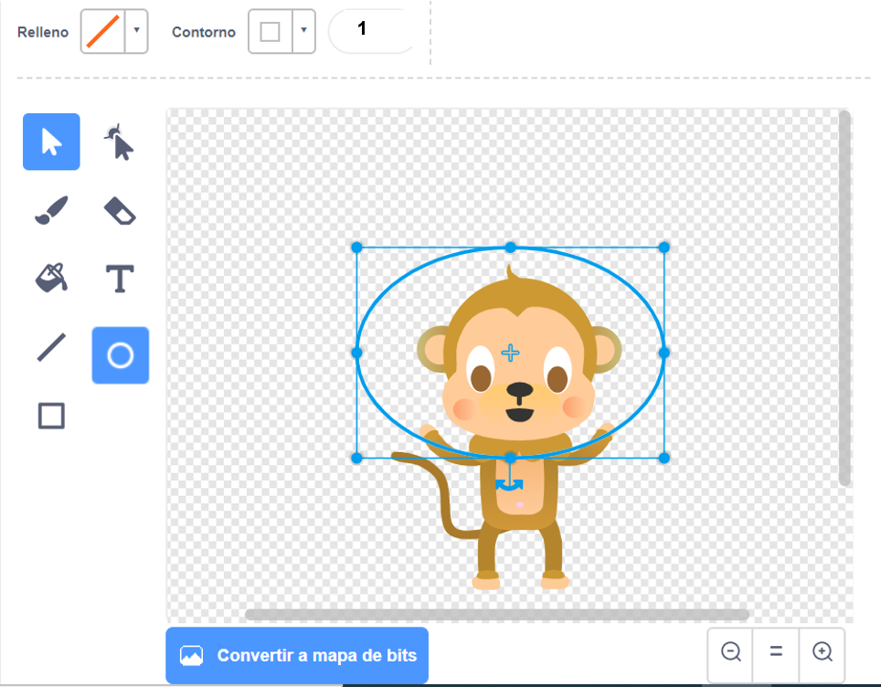

## Mono flotante

¡Ahora agregarás a tu animación un mono que se perdió en el espacio!

\--- task \---

Comienza agregando la figura "Mono" de la biblioteca.



\--- /task \---

Haz clic en su nuevo sprite mono y luego haga clic en ** Disfraces ** para que puedas editar como se ve el mono.

\--- task \---

Establece el relleno para que sea transparente seleccionando la línea roja. Para el contorno, establece un color blanco moviendo el deslizador de Saturación a `0`.



\--- /tarea \---

\--- task \---

Haz clic en la herramienta **círculo ** y luego úsalo para dibujar un casco espacial blanco alrededor de la cabeza del mono.



\--- /task \---

\--- task \---

¿Puedes agregar código a la figura de tu mono para que gire lentamente en un círculo para siempre?

\--- hints \--- \--- hint \---

Cuando se hace clic en la bandera verde ** **, tu objeto del mono debería ** girar ** en un círculo ** para siempre **.

\--- /hint \--- \--- hint \---

Aquí están los bloques de código que necesitas:

```blocks3
siempre
fin

gire (15) grado en onda contínua

cuando seleccione la bandera
```

\--- /hint \--- \--- hint \---

Aquí está el código para hacer girar a tu mono:


```blocks3
when flag clicked
forever
    turn cw (1) degrees
```

\--- /hint \--- \--- /hints \---

\--- /task \---

Prueba y guarda tu proyecto. Tendrás que hacer clic en el botón rojo de **parar** para finalizar esta animación, ¡ya que continúa para siempre!

