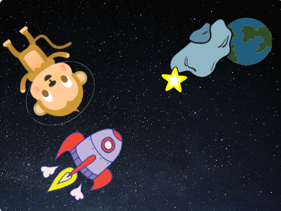

## Una estrella brillante

Ahora combinarás bucles para hacer una estrella brillante.

--- task ---

Agrega un objeto "Estrella" ("Star") a tu escenario.



--- /task ---

--- task ---

¿Puedes añadir código a tu objeto de estrella para que la estrella crezca y se reduzca repetidamente?


--- hints ---
 --- hint ---

Cuando **se hace clic en la bandera** verde, tu figura estrella debería **cambiar de tamaño** para hacerse más grande unas cuantas veces, y luego **cambiar de tamaño** para hacerse más pequeña unas cuantas veces. Deberías hacer esto para que se haga más grande y luego más pequeño **para siempre** y parece que está brillando su luz.

--- /hint --- --- hint ---

Aquí están los bloques de código que necesitas:

```blocks3
repeat (10)
end

when flag clicked

repeat (10)
end

change size by (10)

change size by (10)

forever
```

--- /hint --- --- hint ---

Este es el código para hacer que tu estrella crezca y se encoja:


```blocks3
when flag clicked
forever
    repeat (20)
        change size by (2)
    end
    repeat (20)
        change size by (-2)
    end
```

--- /hint ------ /hints --- --- /task ---