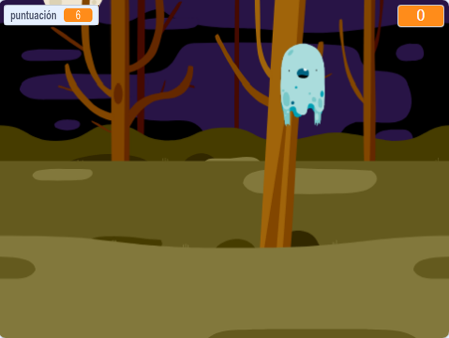

## ¿Qué sigue?

Prueba el proyecto [ Cazafantasmas ](https://projects.raspberrypi.org/en/projects/ghostbusters?utm_source=pathway&utm_medium=whatnext&utm_campaign=projects)! En ese proyecto aprenderás cómo crear un juego con fantasmas que aparecen por todas partes y que debes atrapar. También aprenderás cómo agregar un cronómetro y una puntuación al juego, para que puedas ver cuántos fantasmas puedes capturar.

\--- no imprimir \---

  <iframe allowtransparency="true" width="485" height="402" src="https://scratch.mit.edu/projects/embed/276874679/?autostart=false" frameborder="0" scrolling="no"></iframe>
  

\--- /no-imprimir \---

\--- print-only \---

\--- /print-only \---