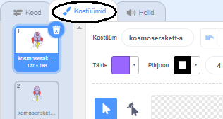
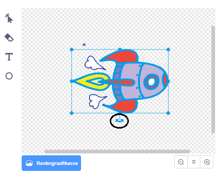

## Kosmoselaeva animeerimine

Esimese sammuna lood kosmoselaeva, mis lendab Maa poole!

\--- ülesanne \---

Ava uus Scratch projekt.

**Veebis:**ava uus Scratchi veebiprojekt aadressil [rpf.io/scratch-new](http://rpf.io/scratchon){:target="_blank"}.

**Võrguühenduse puudumisel:** ava uus projekt võrguvälises redaktoris.

Kui sul on vaja alla laadida ja installida Scratchi võrguväline redaktor, mine aadressile [rpf.io/scratchoff](http://rpf.io/scratchoff){:target="_blank"}.

\--- /task \---

\--- task \--- Lisa oma Lavale „kosmoselaeva” ja „Maa” spraidid.


[[[generic-scratch3-sprite-from-library]]]

\--- /task \---

\--- task \--- Lisa oma Lavale taust „Tähed”.


\--- /task \---

\--- task \--- Klõpsa oma kosmoselaeva spraidil, seejärel klõpsa vahekaardil **Kostüümid**.



\--- /task \---

\--- task \--- Kasuta **noole** tööriista, et klõpsata ja nihutada kast ümber kogu kosmoselaeva pildi. Seejärel klõpsa ringikujulisel **pööra** pidemel ja pööra pilti, kuni see on külili.



\--- /task \---

\--- task \--- Lisa see kood oma kosmoselaeva spraidile:


```blocks3
kui klõpsata ⚑
osuta suunas (0)
mine x: (-150) y: (-150)
ütle [Lähme] (2) sek
osuta (Maa) -le
liugle (1) sekundiga x: (0) y: (0)
```

Muuda lisatud koodiplokkide numbreid nii, et kood oleks täpselt selline nagu ülal.

\--- /task \---

Kui klõpsad rohelisel lipul, peaksid nägema kosmoselaeva rääkimas, pööramas ja lava keskosa suunas liuglemas.

