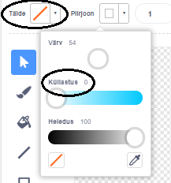
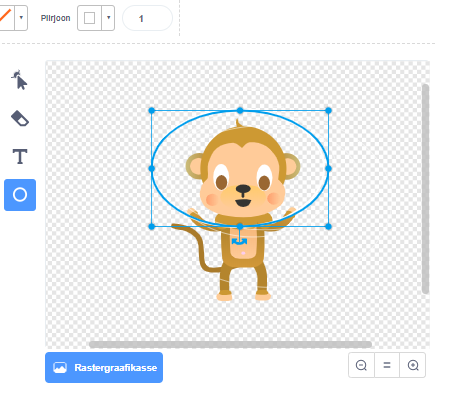

## Hõljuv ahv

Nüüd lisad oma animatsioonile ahvi, kes on kosmosesse ära eksinud!

\--- task \--- Alusta, lisades teegist 'ahvi' sprait.


\--- /task \---

Klõpsa oma uuel ahvi spraidil, seejärel klõpsa **Kostüümidel**, et saaksid muuta ahvi välimust.

\--- task \--- Määra täide läbipaistvaks, valides punane joon. Piirjoone jaoks määra valge värv, liigutades küllastuse liugurit asendisse `0`.

 \--- /task \---

\--- task \--- Klõpsa **ringi** tööriiistal ja seejärel kasuta seda ahvi pea ümber valge kosmosekiivri joonistamiseks.



\--- /task \---

\--- task \--- Kas oskad oma ahvi spraidile koodi lisada, nii et see alati aeglaselt ringis pöörleks?

\--- hints \--- \--- hint \---

Kui rohelisele **lipule klõpsata**, peaks sinu ahvi sprait **igavesti** **pöörlema**.

\--- /hint \--- \--- hint \---

Siin on vajalikud koodiplokid:

```blocks3
korda lõputult
end

pööra ↻ (15) kraadi

kui klõpsata ⚑
```

\--- /hint \--- \--- hint \---

Siin on kood, mis paneb sinu ahvi pöörlema:


```blocks3
kui klõpsata ⚑
korda lõputult 
pööra ↻ (1) kraadi
```

\--- /hint \--- \--- /hints \---

\--- /task \---

Testi ja salvesta oma projekt. Selle animatsiooni lõpetamiseks pead klõpsama punasel **stop** nupul, sest see kestab igavesti!

