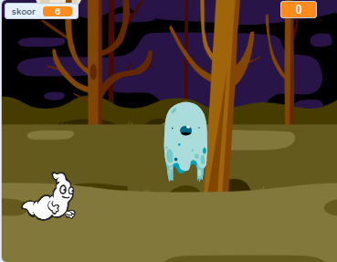

## Mis edasi?

Proovi [Tondipüüdjate](https://projects.raspberrypi.org/en/projects/ghostbusters?utm_source=pathway&utm_medium=whatnext&utm_campaign=projects) projekti! Selles projektis õpid, kuidas luua mängu tontidega, kes ilmuvad igale poole ja keda sa kinni püüdma pead. Õpid ka taimeri ja skoori lisamist mängule, et näeksid, mitu tonti kinni püüda suudad.

\--- no-print \---

  <iframe allowtransparency="true" width="485" height="402" src="https://scratch.mit.edu/projects/embed/276874679/?autostart=false" frameborder="0" scrolling="no"></iframe>
  

\--- /no-print \---

\--- print-only \---

\--- /print-only \---